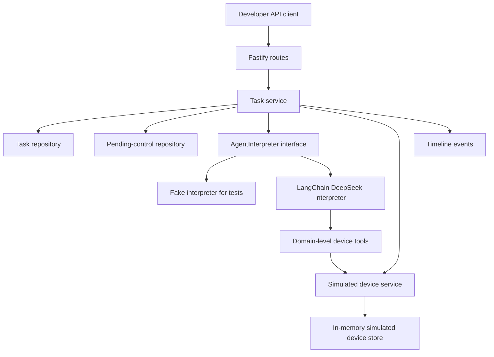
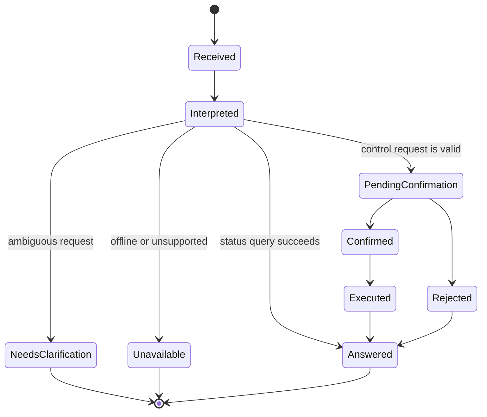
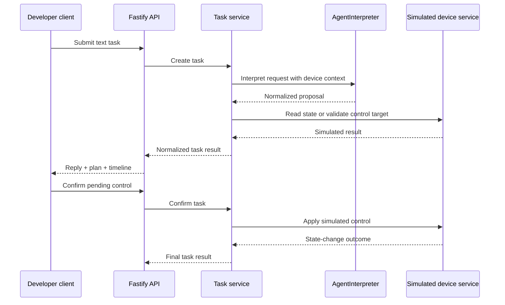

# feat: Build Agent Plan Contract service

## Summary

Build a greenfield TypeScript backend that exposes the text-first Agent Plan Contract for simulated IoT devices. The service will use Fastify for the developer-facing API, LangChain TS for the DeepSeek interpretation adapter, and service-owned domain code for task records, confirmation state, simulated device mutation, and timeline audit.

---

## Problem Frame

The origin requirements define a narrow V1: remove the device and data-item lookup work that currently happens manually in the WeChat mini program. The first proof is not an end-user app or voice assistant; it is a developer-testable backend where natural-language text resolves simulated device status, creates confirmable control requests, and records enough plan/timeline detail to debug the Agent's interpretation.

The repository currently contains only planning documents, so this plan creates the service scaffold, contracts, domain modules, tests, and developer docs from scratch.

---

## Requirements

**Task Contract**

- R1. The service accepts text task requests and returns a normalized task result with a user reply, task classification, structured plan, execution state, and timeline. Origin: R1-R4, R17-R19.
- R2. Task records are inspectable after the initial response through stable task identifiers. Origin: R3, R19.
- R3. The public response contract does not require clients to understand LangChain messages, model tool-call objects, or provider-specific payloads. Origin: R24-R27.

**Device Query And Control**

- R4. Status queries resolve common references to simulated light, air-conditioner, and sensor data without exact data-item names. Origin: R5-R8, R14-R16.
- R5. Control requests create pending confirmations and mutate simulated state only after confirmation succeeds. Origin: R9-R13, R16, R23.
- R6. Offline, unsupported, stale, ambiguous, rejected, and unconfirmed paths are represented as first-class outcomes. Origin: R7-R8, R12-R13, R15, F2, F5.

**LLM Orchestration Boundary**

- R7. LangChain TS is used behind an interpreter interface to integrate DeepSeek, tools, and structured output, while service-side validation owns canonical task semantics. Origin: R24-R28.
- R8. The core task service is testable with a fake interpreter and does not require live DeepSeek calls in the normal test suite. Origin: R28.

**Developer Validation**

- R9. The service includes regression coverage for status lookup, ambiguity, pending control, confirmed mutation, rejected control, offline control, and unavailable data. Origin: AE1-AE5.
- R10. Developer documentation explains environment setup, API usage, simulated devices, confirmation flow, and how to run optional live DeepSeek smoke checks.

---

## Key Technical Decisions

- KTD1. Fastify on Node 20 for the API layer: Fastify v5 supports Node 20+ and gives enough structure for typed routes without introducing NestJS-level module ceremony for this compact V1 surface.
- KTD2. Pin the first dependency set: use `langchain@1.4.4`, `@langchain/deepseek@1.0.27`, `@langchain/core@1.1.48`, `fastify@5.8.5`, `vitest@4.1.8`, and `zod@4.4.3` as the initial pinned versions checked on 2026-06-07.
- KTD3. Keep LangChain behind `AgentInterpreter`: the domain service consumes normalized interpretation proposals, not LangChain runtime objects, so future model/provider or LangGraph changes do not break the public contract.
- KTD4. Default to `deepseek-v4-flash`: it supports JSON Output and Tool Calls and is the lower-cost V4 option; `deepseek-v4-pro` remains configurable for harder interpretation cases.
- KTD5. Use Zod as the canonical contract schema language: API handlers, normalized interpreter proposals, and test fixtures validate against the same schemas before any model output is trusted. Fastify route-level schemas should stay minimal or generated from those Zod schemas; do not hand-maintain a second full response contract.
- KTD6. Use in-memory repositories for V1: task records, pending controls, and simulated device state persist consistently within one service process, with repository interfaces preserving a later path to file or database storage.
- KTD7. Defer LangGraph: the V1 confirmation flow is service-owned and short-lived enough for plain LangChain agents plus domain pending tasks; LangGraph becomes relevant if durable, resumable, or richer human-in-the-loop workflows are needed.

---

## High-Level Technical Design



The API layer should remain thin: parse requests, call the task service, and serialize the normalized response. The task service is the canonical owner of validation, task classification, pending-control lifecycle, simulated execution, and timeline events.





---

## Output Structure

```text
.
├── package.json
├── pnpm-lock.yaml
├── tsconfig.json
├── vitest.config.ts
├── .env.example
├── README.md
├── docs/
│   ├── brainstorms/
│   ├── contracts/
│   │   └── agent-plan-contract.md
│   └── plans/
├── src/
│   ├── agent/
│   ├── config/
│   ├── contracts/
│   ├── domain/
│   ├── routes/
│   ├── app.ts
│   └── server.ts
└── tests/
    ├── agent/
    ├── contracts/
    ├── domain/
    ├── fixtures/
    └── integration/
```

The exact internal filenames may shift during implementation, but the main boundary should stay intact: contracts, domain, agent adapter, routes, and tests remain separate.

---

## Implementation Units

### U1. Project Scaffold And Contracts

- **Goal:** Create the TypeScript service scaffold, dependency manifest, environment config, and first-pass contract schemas for tasks, plans, timeline events, pending controls, and devices.
- **Requirements:** R1, R2, R3, R7, R10; origin R1-R4, R17-R19, R24-R27.
- **Dependencies:** None.
- **Files:** `package.json`, `pnpm-lock.yaml`, `tsconfig.json`, `vitest.config.ts`, `.env.example`, `src/config/env.ts`, `src/contracts/task-contract.ts`, `src/contracts/device-contract.ts`, `tests/contracts/task-contract.test.ts`, `docs/contracts/agent-plan-contract.md`.
- **Approach:** Initialize Node 20 TypeScript with ESM, Fastify, LangChain, DeepSeek integration, Zod, and Vitest. Define contract schemas before domain code so later units compile against a stable shape. Include `DEEPSEEK_API_KEY`, `DEEPSEEK_MODEL`, and an interpreter mode setting in env config, but do not require live credentials for test mode.
- **Execution note:** Start with contract tests so response semantics are pinned before API and agent code exist.
- **Patterns to follow:** Use the origin document's terms: task result, task identifier, structured understanding, pending control request, simulated device layer, and timeline.
- **Test scenarios:**
  - Valid status-query task result parses with task id, classification, reply, plan, selected device context, and timeline.
  - Valid pending-control task result parses with confirmation summary and no simulated state mutation marker.
  - Ambiguous and unavailable task results parse without requiring selected control actions.
  - Malformed task results fail validation when required timeline or classification fields are missing.
  - Env config allows fake interpreter mode without `DEEPSEEK_API_KEY` and rejects live DeepSeek mode without credentials.
- **Verification:** The project installs, type-checks, and validates the core contract fixtures without any live model or HTTP server.

### U2. Simulated Device Domain

- **Goal:** Implement the simulated light, air-conditioner, and environmental sensor layer with realistic data items, controllable items, online/offline states, and consistent in-process state changes.
- **Requirements:** R4, R5, R6; origin R5-R8, R11-R16, F1, F5, AE1-AE4.
- **Dependencies:** U1.
- **Files:** `src/domain/devices/device-types.ts`, `src/domain/devices/simulated-registry.ts`, `src/domain/devices/simulated-device-store.ts`, `src/domain/devices/device-resolver.ts`, `tests/domain/simulated-device-store.test.ts`, `tests/domain/device-resolver.test.ts`.
- **Approach:** Represent devices through domain capabilities rather than raw IoT platform fields. Seed at least one online light, one offline or unavailable branch, one air conditioner with power/mode/target temperature/room temperature, and one read-only environmental sensor. Keep state mutation inside the simulated store so a later query observes confirmed control effects.
- **Patterns to follow:** Keep capability names close to future IoT adapter concepts: room, device name, data item, control item, readable value, writable value, freshness, availability.
- **Test scenarios:**
  - Covers AE1. A natural status target for the air conditioner resolves to power, mode, target temperature, and room temperature without exact data-item names.
  - Covers AE2. Applying a confirmed light power control changes the later readable light state.
  - Covers AE4. Offline device reads and controls return unavailable outcomes without mutating state.
  - Ambiguous room or device phrases return candidate matches rather than silently choosing one.
  - Unsupported control items return unsupported outcomes while preserving existing state.
  - Sensor data is read-only and rejects write attempts.
- **Verification:** Simulated state behaves consistently across sequential domain calls and covers online, offline, read-only, writable, ambiguous, and unsupported branches.

### U3. Task Lifecycle, Timeline, And Confirmation Service

- **Goal:** Add the service layer that creates tasks, records timeline stages, normalizes interpreter proposals, creates pending controls, confirms or rejects controls, and applies simulated state changes.
- **Requirements:** R1, R2, R3, R5, R6, R7, R8, R9; origin R1-R4, R9-R13, R16-R19, R23-R28, F1-F5, AE2-AE5.
- **Dependencies:** U1, U2.
- **Files:** `src/domain/tasks/task-service.ts`, `src/domain/tasks/task-repository.ts`, `src/domain/tasks/pending-control-repository.ts`, `src/domain/tasks/timeline.ts`, `tests/domain/task-service.test.ts`, `tests/fixtures/task-fixtures.ts`.
- **Approach:** Treat interpreter output as a proposal. The task service validates selected devices and capabilities, decides whether the task is answered, ambiguous, unsupported, unavailable, or pending confirmation, and appends timeline events for each meaningful stage. Confirmation endpoints operate on stored pending controls, not on a fresh model interpretation.
- **Technical design:** Directional lifecycle rule: every task starts with `request_received`, then records interpretation, service validation, device resolution, and final outcome; control tasks add confirmation-required and confirmation-received stages when applicable.
- **Patterns to follow:** Keep model interpretation, service validation, and simulated device response as distinct timeline sources to support origin R18.
- **Test scenarios:**
  - Covers F1 / AE1. Status query creates a completed task with selected device/data items, reply, and timeline stages for interpretation, resolution, simulated read, and final outcome.
  - Covers F2 / AE5. Ambiguous query returns clarification with candidate context and no simulated mutation.
  - Covers F3 / AE3. Control request creates a pending control and leaves device state unchanged until confirmation.
  - Covers F4 / AE2. Confirming a pending control applies simulated mutation and a later status task reflects the new state.
  - Rejecting a pending control records rejection and leaves simulated state unchanged.
  - Confirming a missing, expired, already confirmed, or rejected pending control returns a non-success outcome without mutation.
  - Interpreter proposals that reference unknown devices or unsupported controls are downgraded to unavailable or unsupported outcomes.
- **Verification:** The task service can execute all origin key flows through domain calls without Fastify or live DeepSeek.

### U4. LangChain DeepSeek Interpreter Adapter

- **Goal:** Implement the `AgentInterpreter` boundary with a fake interpreter for deterministic tests and a LangChain DeepSeek adapter for live interpretation experiments.
- **Requirements:** R3, R7, R8, R9; origin R24-R28 and the LangChain TS technical direction.
- **Dependencies:** U1, U2, U3.
- **Files:** `src/agent/agent-interpreter.ts`, `src/agent/fake-interpreter.ts`, `src/agent/langchain-deepseek-interpreter.ts`, `src/agent/agent-prompts.ts`, `src/agent/agent-schemas.ts`, `src/agent/device-tools.ts`, `tests/agent/fake-interpreter.test.ts`, `tests/agent/langchain-adapter-contract.test.ts`, `tests/fixtures/sample-utterances.ts`.
- **Approach:** Use LangChain `createAgent` with `ChatDeepSeek`, domain-level device tools, and Zod-backed structured output. The adapter returns normalized proposals only: status query, control request, ambiguous request, unsupported request, or parse failure. Device tools expose resolve/read/propose-control capabilities, never raw real-device APIs.
- **Patterns to follow:** Mirror the origin boundary: LangChain can suggest intent and call tools, but task records, confirmation, and simulated mutation stay in the service layer.
- **Test scenarios:**
  - Fake interpreter maps representative status, control, ambiguous, unsupported, and offline utterances into normalized proposals.
  - LangChain adapter converts a mocked structured response into the same proposal shape as the fake interpreter.
  - Schema validation rejects model output with missing target device, invalid task type, invalid control value, or multiple incompatible intents.
  - Tool wrappers return domain-level results and do not mutate state for proposed controls.
  - Live DeepSeek smoke test is opt-in and skipped by default when credentials are absent.
- **Verification:** Core tests pass without network access, and an optional local smoke check can invoke DeepSeek when credentials are configured.

### U5. Fastify Task API

- **Goal:** Expose the developer-facing HTTP API for submitting text tasks, inspecting task records, confirming or rejecting pending controls, and reading a debug snapshot of simulated devices.
- **Requirements:** R1, R2, R3, R4, R5, R6, R10; origin R1-R4, R9-R19, R22, F1-F5.
- **Dependencies:** U1, U2, U3, U4.
- **Files:** `src/app.ts`, `src/server.ts`, `src/routes/tasks.ts`, `src/routes/simulated-devices.ts`, `tests/integration/tasks-api.test.ts`, `tests/integration/simulated-devices-api.test.ts`.
- **Approach:** Build Fastify routes as thin adapters over the task service. Keep request/response validation aligned with contract schemas. Use dependency injection at app construction so tests can run against fake interpreter and in-memory repositories.
- **Technical design:** Directional route surface: create task, get task, confirm pending control, reject pending control, and get read-only simulation snapshot. The simulation snapshot is developer-only V1 support and must not become a real IoT adapter contract.
- **Patterns to follow:** Treat Zod schemas as canonical. If Fastify route-level validation is used, keep it limited to simple request envelopes or derive it from the Zod source instead of duplicating the full task-result contract by hand.
- **Test scenarios:**
  - Creating a status task returns a normalized completed task result and persists it for later retrieval.
  - Creating a control task returns pending confirmation and does not mutate simulated state.
  - Confirming the pending task returns executed outcome and mutates simulated state.
  - Rejecting the pending task returns rejected outcome and leaves simulated state unchanged.
  - Getting an unknown task returns a non-success API result without leaking internals.
  - Ambiguous, unsupported, offline, and malformed request bodies return stable contract-shaped responses or validation errors.
  - API responses from each route parse through the shared Zod task-result schemas, preventing Fastify serialization from drifting from the public contract.
  - Debug simulation snapshot is read-only and reflects confirmed simulated state changes.
- **Verification:** The HTTP API demonstrates all origin flows through integration tests using Fastify's in-process injection or equivalent server test harness.

### U6. Regression Suite And Developer Documentation

- **Goal:** Add end-to-end regression coverage and developer docs that make the V1 service easy to run, inspect, and extend.
- **Requirements:** R8, R9, R10; origin success criteria, AE1-AE5, Scope Boundaries, Dependencies And Assumptions.
- **Dependencies:** U1-U5.
- **Files:** `tests/fixtures/sample-utterances.ts`, `tests/integration/agent-plan-contract.e2e.test.ts`, `README.md`, `docs/contracts/agent-plan-contract.md`.
- **Approach:** Encode sample utterances around the origin acceptance examples: air-conditioner status, light control confirmation, unconfirmed control, offline control, and ambiguous device references. Document fake mode as the default local path and live DeepSeek mode as optional.
- **Patterns to follow:** Keep examples developer-facing and inspectable, matching the origin decision to favor curl, Postman, and scripts over polished end-user copy.
- **Test scenarios:**
  - Covers AE1. Air-conditioner status utterance returns selected data items and values.
  - Covers AE2. Light-on request, confirmation, and follow-up status query show the state transition.
  - Covers AE3. Light-on request without confirmation leaves the follow-up status unchanged.
  - Covers AE4. Offline control returns unavailable and does not create an executable action.
  - Covers AE5. Ambiguous bedroom reference asks for clarification and exposes candidates.
  - Sample utterance fixture can run entirely against fake interpreter mode for deterministic regression.
- **Verification:** A developer can start from the README, run the fake-mode service/tests, inspect task plans and timelines, and optionally configure live DeepSeek without changing code.

---

## Acceptance Examples

- AE1. Status query finds the right data item: a natural-language air-conditioner status request returns power, mode, target temperature, room temperature, selected simulated device/data items, and timeline evidence.
- AE2. Confirmed control changes later query results: a light control request creates a pending control, confirmation mutates simulated state, and a later status query reports the new state.
- AE3. Unconfirmed control does not mutate state: a pending light control left unconfirmed keeps the simulated light unchanged.
- AE4. Offline control is blocked: an offline simulated device returns unavailable and does not create an executable mutation.
- AE5. Ambiguous device reference does not guess: a vague request with multiple plausible matches returns clarification and candidate context.

---

## Scope Boundaries

### In Scope

- Greenfield TypeScript backend scaffold, Fastify routes, contract schemas, simulated devices, in-memory task/control state, LangChain DeepSeek adapter, fake interpreter, and tests.
- Developer-facing docs and sample utterances for fake-mode and optional live DeepSeek validation.

### Deferred To Follow-Up Work

- Real IoT platform adapters and mutations against production device state.
- MiMo ASR/TTS, wake words, audio streaming, and voice-specific response shaping.
- End-user frontend or WeChat mini program integration.
- LangGraph durable orchestration, unless V1 implementation proves plain LangChain plus service-owned pending tasks cannot express the flow.
- Persistent storage beyond in-process repositories, real household permission models, audit retention policy, and production observability.

---

## System-Wide Impact

This plan establishes the public Agent Plan Contract and should be treated as the baseline for later mini program, app, voice, and real IoT adapter work. The most important architectural boundary is that future clients depend on task semantics, not on LangChain internals or simulated device implementation details.

---

## Risks And Dependencies

- **LLM variability:** DeepSeek may return malformed or over-eager interpretations. Mitigation: validate every proposal with Zod and service-side capability checks, and keep deterministic fake-interpreter regression tests.
- **Framework churn:** LangChain JS and `@langchain/deepseek` are active libraries. Mitigation: pin exact versions and isolate them behind `AgentInterpreter`.
- **In-memory state limits:** V1 state resets on process restart and is not safe for multi-process deployment. Mitigation: document this as V1 behavior and keep repository interfaces ready for later persistence.
- **Contract drift:** Public API fields can become coupled to implementation details. Mitigation: contract tests reject LangChain-specific required fields and docs describe normalized task semantics only.
- **Schema drift:** Fastify route schemas and Zod contracts can diverge if both are hand-written. Mitigation: make Zod the canonical schema, validate responses against it in tests, and only add full route JSON schemas through an explicit generation bridge.
- **Live model cost and credentials:** DeepSeek smoke checks require `DEEPSEEK_API_KEY` and may incur cost. Mitigation: make live checks opt-in and keep normal tests offline.

---

## Documentation And Operational Notes

- `README.md` should document Node 20, package manager usage, fake interpreter mode, optional DeepSeek environment variables, and example API flows.
- `.env.example` should include placeholders for `DEEPSEEK_API_KEY`, `DEEPSEEK_MODEL`, interpreter mode, host, and port.
- `docs/contracts/agent-plan-contract.md` should describe the normalized task result, task classifications, pending-control lifecycle, timeline stages, and simulated device assumptions.
- No production deployment, monitoring, or real-device operational runbook is required for V1.

---

## Sources And Research

- Origin requirements: `docs/brainstorms/2026-06-06-agent-plan-contract-requirements.md`.
- Prior ideation: `docs/ideation/2026-06-06-iot-server-agent-ideation.md`.
- LangChain structured output supports `createAgent` response schemas, Zod schemas, provider/tool strategies, and validated `structuredResponse`: https://docs.langchain.com/oss/javascript/langchain/structured-output.
- LangChain ChatDeepSeek integration documents `@langchain/deepseek`, `DEEPSEEK_API_KEY`, tool calling, structured output, and streaming support: https://docs.langchain.com/oss/javascript/integrations/chat/deepseek/.
- LangGraph is deferred because its core value is durable, long-running, stateful orchestration with persistence and human-in-the-loop support: https://docs.langchain.com/oss/javascript/langgraph/overview.
- DeepSeek Tool Calls documentation states that the model returns tool calls and the user-provided application executes the actual function: https://api-docs.deepseek.com/guides/tool_calls.
- DeepSeek Models & Pricing lists `deepseek-v4-flash` and `deepseek-v4-pro` with JSON Output and Tool Calls support: https://api-docs.deepseek.com/quick_start/pricing.
- Fastify v5 requires Node 20+ and full JSON schemas for route validation surfaces: https://fastify.dev/docs/v5.7.x/Guides/Migration-Guide-V5/.
- Fastify TypeScript docs show TypeScript setup, typed route generics, and schema validation patterns: https://fastify.dev/docs/v5.7.x/Reference/TypeScript/.
- Vitest supports backend code, ESM, and TypeScript without requiring a Vite app: https://vitest.dev/.
