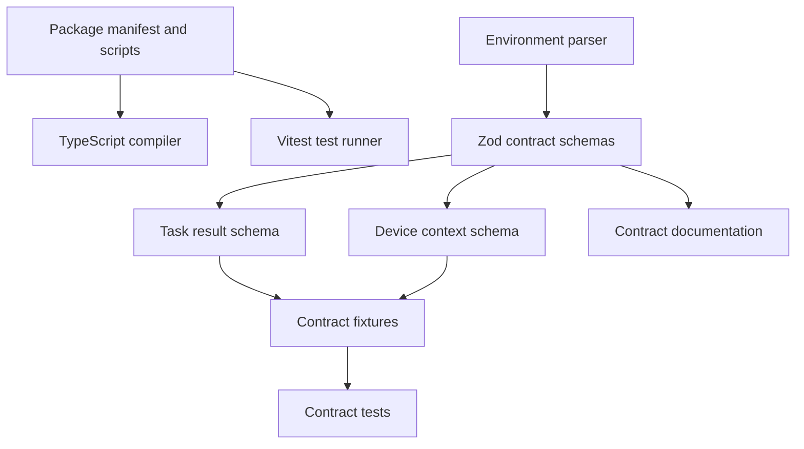
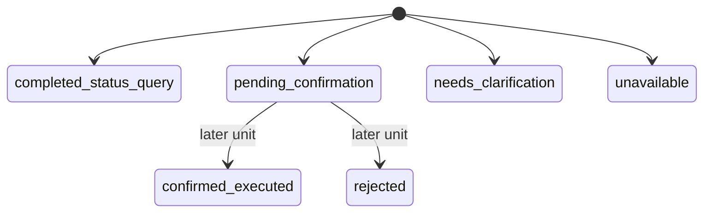

# feat: Detail Project Scaffold And Contracts

## Summary

Create the first implementation slice for the Agent Plan Contract service: Node 20 TypeScript project scaffold, pinned dependency manifest, environment configuration, Zod-based public contract schemas, contract fixtures, and contract documentation. This plan details only the parent plan's `U1. Project Scaffold And Contracts`; simulated device behavior, task lifecycle execution, Fastify routes, and LangChain adapter behavior remain follow-up units in the parent plan.

---

## Problem Frame

The parent plan establishes a greenfield backend where all later behavior depends on stable contracts. Before device simulation or LLM interpretation code exists, the repository needs a compilable service skeleton and contract schemas that express task results, task identifiers, classifications, plan details, timeline stages, pending controls, and simulated device context without leaking LangChain provider objects.

The first slice should make later units cheaper to implement: domain code can compile against shared types, API routes can validate responses against the same schemas, and documentation can show the contract shape before behavior is wired in.

---

## Requirements

**Project Foundation**

- R1. The repository has a Node 20 TypeScript ESM scaffold with package metadata, scripts, compiler configuration, Vitest configuration, and a generated lockfile.
- R2. Dependency versions match the parent plan's checked package set: `fastify@5.8.5`, `langchain@1.4.4`, `@langchain/deepseek@1.0.27`, `@langchain/core@1.1.48`, `vitest@4.1.8`, and `zod@4.4.3`.
- R3. The scaffold does not require live DeepSeek credentials for installation, type checking, or normal tests.

**Configuration Contract**

- R4. Environment parsing distinguishes fake interpreter mode from live DeepSeek mode and rejects live mode when `DEEPSEEK_API_KEY` is missing.
- R5. Runtime configuration exposes host, port, interpreter mode, and DeepSeek model with stable defaults suitable for local development.

**Agent Plan Contract**

- R6. Task contract schemas define task id, original user text, classification, execution state, user reply, structured plan, selected context, pending control, and timeline.
- R7. Device contract schemas define simulated device identity, room, capabilities, readable data items, writable control items, availability, freshness, and value metadata.
- R8. The public contract excludes required LangChain messages, tool-call objects, run objects, provider response payloads, and other implementation-specific model artifacts.

**Validation And Documentation**

- R9. Contract tests cover valid status-query, pending-control, ambiguous, unavailable, malformed task-result, and environment-config cases.
- R10. `docs/contracts/agent-plan-contract.md` documents the normalized contract, lifecycle states, timeline vocabulary, pending-control semantics, simulated device assumptions, and V1 boundaries.

---

## Key Technical Decisions

- KTD1. Use Zod as the source of truth for contracts: TypeScript types should be inferred from Zod schemas so route handlers, domain services, fixtures, and docs all converge on one validation surface.
- KTD2. Keep Fastify installed but not wired into this slice: the parent plan needs Fastify in the dependency manifest, but route construction belongs to the later API unit.
- KTD3. Model task results around normalized domain concepts: `classification`, `executionState`, `plan`, `selectedContext`, `pendingControl`, and `timeline` are stable public fields; LangChain internals stay optional implementation metadata at most, and not part of the client contract.
- KTD4. Treat confirmation as a contract state, not execution behavior in this slice: schemas and fixtures describe pending controls and confirmation-ready output, but simulated mutation is deferred to later parent units.
- KTD5. Parse environment at the application boundary: `src/config/env.ts` should accept injectable environment input for tests and avoid reading process state at module import time.
- KTD6. Keep IDs and timestamps structurally validated but implementation-neutral: schemas should validate shape and required presence without forcing a storage backend, UUID package, or clock implementation before repositories exist.
- KTD7. Use fixture-driven contract tests: representative JSON-like fixtures make contract drift visible before Fastify serialization or LangChain adapter code is introduced.

---

## High-Level Technical Design



The scaffold should compile before behavior exists. Later parent units consume the schemas from `src/contracts/` instead of redefining task or device response shapes inside routes, domain services, or agent adapters.



This slice defines the allowed public states and validates representative examples. It does not implement transitions between states; the parent plan's task lifecycle unit owns those transitions.

---

## Output Structure

```text
.
├── package.json
├── pnpm-lock.yaml
├── tsconfig.json
├── vitest.config.ts
├── .env.example
├── docs/
│   └── contracts/
│       └── agent-plan-contract.md
├── src/
│   ├── config/
│   │   └── env.ts
│   └── contracts/
│       ├── device-contract.ts
│       └── task-contract.ts
└── tests/
    ├── contracts/
    │   └── task-contract.test.ts
    └── fixtures/
        └── contract-fixtures.ts
```

The exact fixture filename can change during implementation, but fixture data should live outside the test body so later units can reuse it.

---

## Implementation Units

### U1. Package And TypeScript Scaffold

- **Goal:** Create the minimal TypeScript service project with dependency manifest, package scripts, compiler options, Vitest config, and lockfile.
- **Requirements:** R1, R2, R3.
- **Dependencies:** None.
- **Files:** `package.json`, `pnpm-lock.yaml`, `tsconfig.json`, `vitest.config.ts`.
- **Approach:** Configure Node 20 and ESM, define scripts for type checking and tests, and pin the dependency versions from the parent plan. Keep the package surface small: install runtime dependencies needed by later units and dev dependencies needed by this slice.
- **Patterns to follow:** The parent plan's output structure and dependency decisions; no existing code patterns are present in this greenfield repo.
- **Test scenarios:** Test expectation: none -- this unit is project configuration. Its behavior is verified through later contract tests and type checking.
- **Verification:** Dependencies install into a generated lockfile, TypeScript can resolve the project, and Vitest can discover the contract test suite.

### U2. Environment Configuration Boundary

- **Goal:** Add environment parsing for local server settings, fake interpreter mode, and optional live DeepSeek mode.
- **Requirements:** R3, R4, R5.
- **Dependencies:** U1.
- **Files:** `.env.example`, `src/config/env.ts`, `tests/contracts/task-contract.test.ts`.
- **Approach:** Define an injectable parser that reads string input, applies defaults, validates port and interpreter mode, and only requires `DEEPSEEK_API_KEY` when live DeepSeek mode is selected. Include `DEEPSEEK_MODEL` with the parent plan's default of `deepseek-v4-flash`.
- **Execution note:** Add the configuration tests before wiring any service startup code so live credentials never become an accidental test prerequisite.
- **Patterns to follow:** Keep environment parsing isolated from module import side effects; later `src/server.ts` should call the parser at process startup.
- **Test scenarios:**
  - Fake interpreter mode parses successfully with no `DEEPSEEK_API_KEY`.
  - Live DeepSeek mode without `DEEPSEEK_API_KEY` fails validation with a configuration error.
  - Live DeepSeek mode with credentials and a model parses into a complete config object.
  - Missing host, port, interpreter mode, and model use local-development defaults.
  - Invalid port and unknown interpreter mode fail validation.
- **Verification:** Configuration tests prove normal offline development is possible and live mode cannot start without required credentials.

### U3. Task Result Contract Schemas

- **Goal:** Define Zod schemas and inferred TypeScript types for normalized task results, structured plans, pending controls, and timeline events.
- **Requirements:** R6, R8, R9.
- **Dependencies:** U1.
- **Files:** `src/contracts/task-contract.ts`, `tests/contracts/task-contract.test.ts`, `tests/fixtures/contract-fixtures.ts`.
- **Approach:** Model public task responses as normalized domain outcomes. Include task id, original text, classification, execution state, reply, confidence or ambiguity details, plan steps, selected device/data/control context, optional pending control summary, and timeline events with source attribution. Keep provider-specific model metadata out of required fields.
- **Technical design:** Directional schema shape: task result contains identity, request, classification, execution state, response text, structured plan, selected context, pending control when applicable, and timeline. Timeline events include stage, source, status, timestamp, and concise detail.
- **Patterns to follow:** Preserve the origin terms `task result`, `task identifier`, `structured understanding`, `pending control request`, and `timeline`.
- **Test scenarios:**
  - Valid status-query fixture parses with task id, classification, reply, structured plan, selected data items, execution state, and timeline.
  - Valid pending-control fixture parses with confirmation summary and no field claiming simulated mutation already happened.
  - Valid ambiguous fixture parses with candidate context and no selected executable action.
  - Valid unavailable fixture parses with unavailable outcome, failure attribution, and no success state.
  - Malformed fixture without required classification fails validation.
  - Malformed fixture without timeline fails validation.
  - Fixture containing LangChain messages or tool-call payloads is not required to parse as part of the public contract.
- **Verification:** Contract fixtures validate the public task response shapes needed by later domain, agent, and API units.

### U4. Device Context Contract Schemas

- **Goal:** Define Zod schemas and inferred TypeScript types for simulated devices, readable values, writable controls, availability, freshness, and selected context.
- **Requirements:** R7, R8, R9.
- **Dependencies:** U1, U3.
- **Files:** `src/contracts/device-contract.ts`, `src/contracts/task-contract.ts`, `tests/contracts/task-contract.test.ts`, `tests/fixtures/contract-fixtures.ts`.
- **Approach:** Represent devices through capabilities rather than platform-specific raw fields. The schema should support lights, air conditioners, and environmental sensors while remaining generic enough for future real adapters.
- **Technical design:** Directional schema shape: device context contains device identity, display name, room, type, online state, capabilities, readable data item descriptors, writable control item descriptors, value freshness, and optional unavailability reason.
- **Patterns to follow:** Use the origin and parent-plan vocabulary: room, device name, data item, control item, readable value, writable value, freshness, availability.
- **Test scenarios:**
  - Air-conditioner device context fixture parses with power, mode, target temperature, and room temperature readable items.
  - Light device context fixture parses with writable power control and readable state.
  - Environmental sensor fixture parses with read-only values and no writable controls.
  - Offline device fixture parses with availability reason and does not require current readable values.
  - Invalid control descriptor with unsupported value metadata fails validation.
  - Selected context embedded in a task result references device/data/control descriptors without duplicating LangChain internals.
- **Verification:** Device schemas can describe every simulated-device contract shape required by the parent plan without implementing the simulated store.

### U5. Contract Fixture Suite

- **Goal:** Build reusable fixtures and contract tests that lock the first public response semantics before route and domain code exist.
- **Requirements:** R6, R7, R8, R9.
- **Dependencies:** U2, U3, U4.
- **Files:** `tests/fixtures/contract-fixtures.ts`, `tests/contracts/task-contract.test.ts`.
- **Approach:** Encode representative status-query, pending-control, ambiguous, unavailable, and malformed cases. Keep assertions focused on schema acceptance, schema rejection, and the absence of required provider-specific fields.
- **Execution note:** Treat fixtures as regression anchors for later units; when later code produces responses, those responses should parse through the same schemas.
- **Patterns to follow:** Mirror the parent plan's acceptance examples without executing those flows yet.
- **Test scenarios:**
  - Covers status-query contract shape for an air-conditioner status answer.
  - Covers pending-control contract shape for a light power request waiting for confirmation.
  - Covers ambiguous request contract shape with multiple candidate devices.
  - Covers unavailable request contract shape for an offline simulated device.
  - Covers malformed task result rejection for missing classification, missing timeline, and invalid execution state.
  - Covers environment parser behavior for fake and live interpreter modes.
  - Confirms public fixtures do not require LangChain-specific message, tool-call, or run fields.
- **Verification:** The contract test suite can run entirely offline and becomes the shared baseline for later API, domain, and agent-adapter tests.

### U6. Contract Documentation

- **Goal:** Document the V1 Agent Plan Contract so later implementers and developer testers understand the public shape before behavior exists.
- **Requirements:** R8, R10.
- **Dependencies:** U3, U4, U5.
- **Files:** `docs/contracts/agent-plan-contract.md`.
- **Approach:** Write developer-facing documentation that explains task classifications, execution states, plan fields, selected device context, pending-control semantics, timeline event vocabulary, environment modes, and V1 boundaries. Include small example payloads drawn from the test fixtures, but avoid duplicating every schema rule in prose.
- **Patterns to follow:** Match the origin's developer-facing posture: inspectable contract details for curl, Postman, scripts, and later client renderers.
- **Test scenarios:** Test expectation: none -- documentation is verified by alignment with fixture names and schema terminology.
- **Verification:** A developer can read the contract doc and understand which response fields are stable public contract versus deferred implementation details.

---

## Acceptance Examples

- AE1. Offline development works: with fake interpreter mode and no `DEEPSEEK_API_KEY`, configuration parsing and contract tests succeed.
- AE2. Live mode is guarded: selecting live DeepSeek mode without credentials fails configuration validation before any model call can be attempted.
- AE3. Status contract is stable: an air-conditioner status task result validates with selected data items, user reply, structured plan, and timeline.
- AE4. Pending control is explicit: a light-control task result validates as waiting for confirmation and does not claim state mutation.
- AE5. Public contract stays provider-neutral: valid task fixtures do not require LangChain messages, tool-call objects, run objects, or DeepSeek raw payloads.

---

## Scope Boundaries

### In Scope

- Project manifest, lockfile, TypeScript config, Vitest config, `.env.example`, environment parser, Zod contract schemas, reusable fixtures, contract tests, and contract documentation.

### Deferred To Follow-Up Work

- Simulated device registry, resolver, mutable store, and state-change behavior from the parent plan's device-domain unit.
- Task repository, pending-control repository, timeline mutation, confirmation execution, and lifecycle transition behavior from the parent plan's task-service unit.
- Fastify app construction, HTTP route schemas, server startup, and integration tests from the parent plan's API unit.
- Fake interpreter behavior, LangChain DeepSeek adapter behavior, prompts, tools, and optional live smoke checks from the parent plan's agent-adapter unit.
- README runbook and end-to-end sample utterance regression suite from the parent plan's final documentation and regression unit.

---

## Risks And Dependencies

- **Over-specified contracts:** Locking implementation-only details too early would constrain later units. Mitigation: model stable domain semantics and keep exact repository, route, and adapter mechanics out of the public schema.
- **Under-specified contracts:** If schemas omit timeline, selected context, or pending-control detail, later units may diverge. Mitigation: fixtures must cover status, pending, ambiguous, unavailable, and malformed cases.
- **Config side effects:** Reading environment variables at import time can make tests order-dependent. Mitigation: implement environment parsing as an explicit function with injectable input.
- **Schema duplication:** Future Fastify route validation can drift if route schemas are hand-maintained separately. Mitigation: document Zod as canonical and require later API responses to parse through these schemas.
- **Dependency drift:** LangChain and related packages can change quickly. Mitigation: pin the versions verified by the parent plan and the npm registry check on 2026-06-07.

---

## Documentation And Operational Notes

- `.env.example` should include `HOST`, `PORT`, `AGENT_INTERPRETER_MODE`, `DEEPSEEK_API_KEY`, and `DEEPSEEK_MODEL`.
- Fake interpreter mode should be the documented default for local tests and development.
- Live DeepSeek mode should remain opt-in and should not be required by any normal contract test.
- `docs/contracts/agent-plan-contract.md` should avoid promising real IoT adapter behavior, persistent storage, voice behavior, or automatic control.

---

## Sources And Research

- Origin requirements: `docs/brainstorms/2026-06-06-agent-plan-contract-requirements.md`.
- Parent implementation plan: `docs/plans/2026-06-07-001-feat-agent-plan-contract-service-plan.md`.
- Prior ideation: `docs/ideation/2026-06-06-iot-server-agent-ideation.md`.
- npm registry checks on 2026-06-07 confirmed the parent plan's dependency pins for Fastify, LangChain, `@langchain/deepseek`, `@langchain/core`, Vitest, and Zod.
