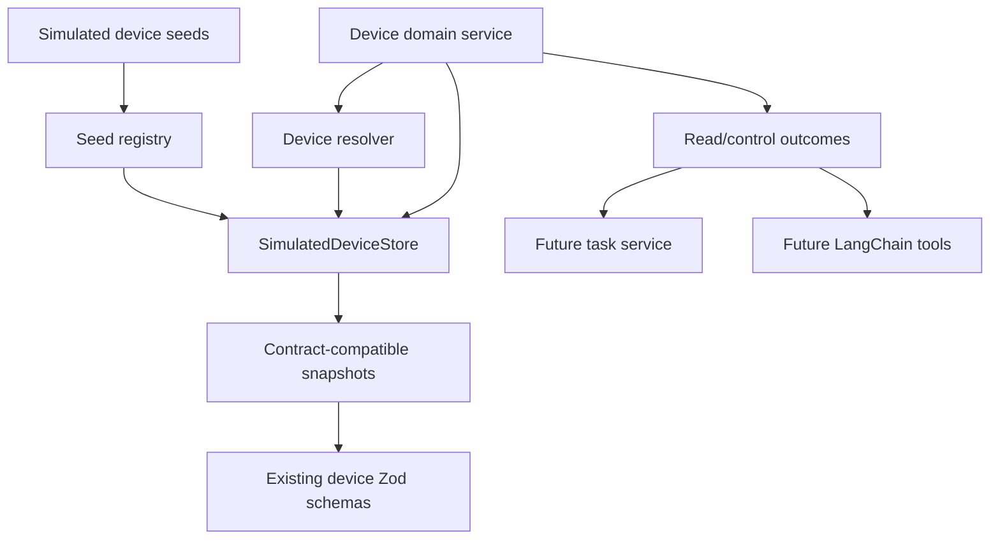
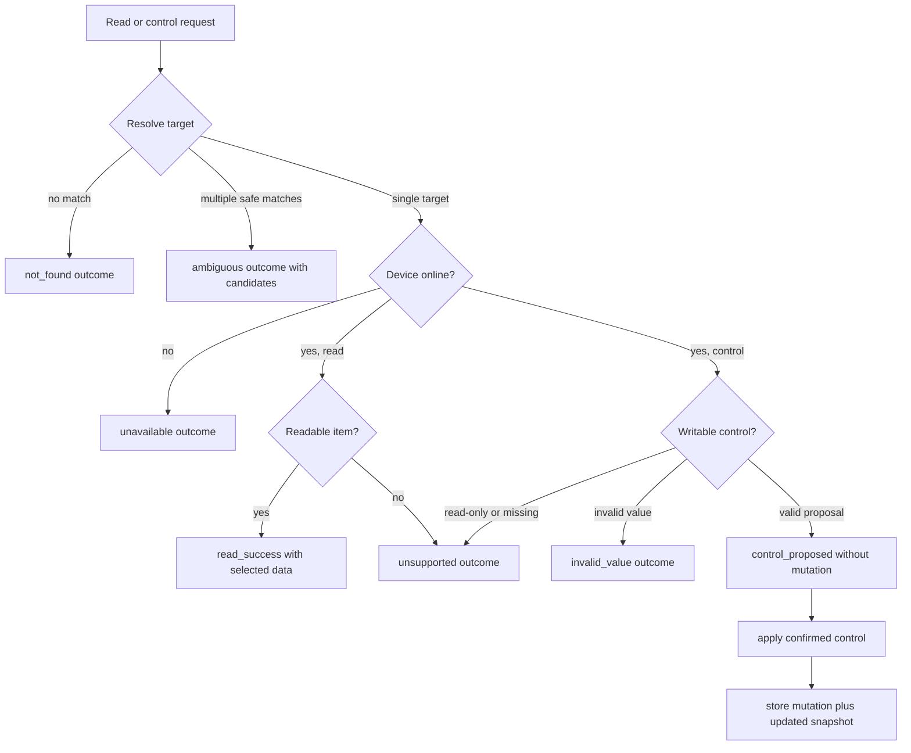
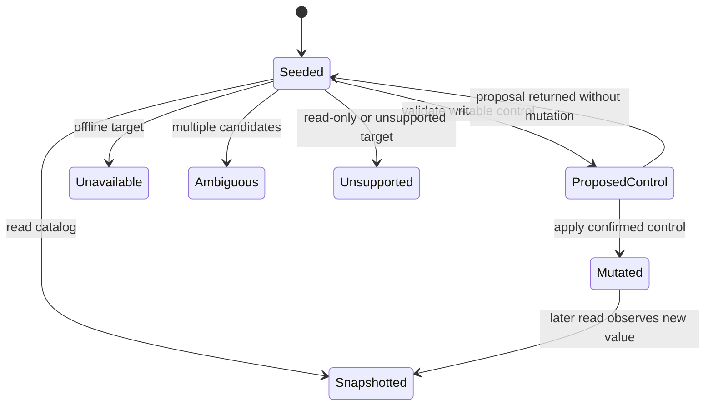

# feat: Detail Simulated Device Domain

## Summary

Build the simulated device domain slice for the Agent Plan Contract service. This plan details only the parent plan's `U2. Simulated Device Domain`: production seed devices, an in-process mutable store, deterministic resolver behavior, read/control domain outcomes, and focused tests that prove simulated state is realistic enough for later task lifecycle, API, and LangChain units.

---

## Problem Frame

The parent plan needs a simulated IoT layer before the task service can prove status lookup, confirmable control, offline handling, and ambiguity behavior. U1 already created public Zod contracts and fixtures; this slice turns those contract shapes into service-owned domain behavior without introducing task records, HTTP routes, or LLM interpretation.

The device domain should be deterministic and test-first friendly. Later units can call it from task services or LangChain tools, but this slice should remain independent of Fastify, task IDs, pending-control repositories, timeline mutation, and provider-specific model objects.

---

## Requirements

**Device Catalog And State**

- R1. The production simulated device catalog includes online light behavior, an offline branch, an air conditioner with power/mode/target-temperature/room-temperature values, and a read-only environmental sensor. Origin: R14-R15, AE1-AE4.
- R2. The domain exposes contract-compatible device snapshots while keeping mutable in-process state owned by the simulated store. Origin: R16.
- R3. Confirmed control application updates later readable values consistently within one process. Origin: R11, R16, AE2.

**Resolution And Operations**

- R4. Status lookup resolves common references by room, device name, type, capability, and data-item intent without requiring exact item IDs. Origin: R5-R8, F1, AE1.
- R5. Ambiguous references return candidate devices or candidate capabilities instead of silently choosing one. Origin: R7, F2, AE5.
- R6. Control validation distinguishes writable controls, read-only sensor data, unsupported controls, invalid values, offline devices, and unavailable state. Origin: R8, R13, R15, F5.
- R7. Proposed controls do not mutate state; only explicit apply operations mutate the simulated store. Origin: R9-R12, R23, AE2-AE3.

**Boundary For Later Units**

- R8. Device-domain APIs return normalized domain outcomes that later task services can translate into task results and timelines without depending on Fastify, LangChain, or DeepSeek objects. Origin: R17-R19, R24-R27.
- R9. Device-domain tests cover status lookup, mutation, non-mutation before apply, offline handling, read-only rejection, ambiguity, unsupported control, and contract compatibility. Origin: R28 and parent R9.

---

## Key Technical Decisions

- KTD1. Treat `src/contracts/device-contract.ts` as the public shape, not the internal state model: domain code can use richer internal records, but snapshots and selected items must parse through the existing Zod schemas.
- KTD2. Put production simulation seeds under `src/domain/devices/`, not under test fixtures: later task, agent-tool, and API units need the same catalog at runtime.
- KTD3. Keep mutation inside `SimulatedDeviceStore`: callers receive snapshots and operation results, so accidental object mutation outside the store cannot change device state.
- KTD4. Use deterministic resolver heuristics for this slice: resolver inputs may include raw phrases and normalized hints, but it should match through domain metadata rather than call an LLM.
- KTD5. Validate control values against metadata before mutation: boolean, enum, and numeric min/max/step constraints are device-domain responsibility because future real adapters need the same safety gate.
- KTD6. Return offline, stale, read-only, unsupported, invalid-value, not-found, and ambiguous cases as typed outcomes instead of throwing normal-domain exceptions.
- KTD7. Keep task lifecycle concerns out of U2: pending-control IDs, confirmation expiry, timeline events, task classification, and user replies belong to later parent-plan units.

---

## High-Level Technical Design



The device domain service should be the facade later units consume. It resolves candidates, reads selected values, proposes controls without mutation, and applies already-confirmed controls through the store. Public task results are still out of scope; this domain returns enough structured facts for later units to build those results.





---

## Output Structure

```text
src/
└── domain/
    └── devices/
        ├── device-results.ts
        ├── device-resolver.ts
        ├── device-types.ts
        ├── simulated-device-seeds.ts
        ├── simulated-device-service.ts
        └── simulated-device-store.ts
tests/
└── domain/
    └── devices/
        ├── device-domain-contract.test.ts
        ├── device-resolver.test.ts
        ├── simulated-device-service.test.ts
        └── simulated-device-store.test.ts
```

The exact file names may change during implementation, but the boundary should remain: seed catalog, store, resolver, service facade, result vocabulary, and domain tests stay separate.

---

## Implementation Units

### U1. Device Domain Types And Outcomes

- **Goal:** Define internal device-domain request and result vocabulary for resolution, reads, control proposals, confirmed control application, and unavailable branches.
- **Requirements:** R6, R8, R9; origin R8, R13, R15, R24-R27.
- **Dependencies:** None.
- **Files:** `src/domain/devices/device-types.ts`, `src/domain/devices/device-results.ts`, `tests/domain/devices/device-domain-contract.test.ts`.
- **Approach:** Use public contract types for snapshots and selected items, but define domain-specific result unions for `read_success`, `control_proposed`, `control_applied`, `ambiguous`, `not_found`, `unavailable`, `unsupported`, and `invalid_value`. Keep these outcomes provider-neutral and task-neutral so later services can map them into task results and timeline events.
- **Execution note:** Start with tests for result compatibility before writing resolver or mutation logic.
- **Patterns to follow:** `src/contracts/device-contract.ts` and the fixture vocabulary in `tests/fixtures/contract-fixtures.ts`.
- **Test scenarios:**
  - A read-success outcome carrying selected data items can be converted to shapes that parse through `selectedDataItemSchema`.
  - A control-proposed outcome carrying a target control can be converted to a shape that parses through `selectedControlItemSchema`.
  - Unavailable, unsupported, invalid-value, not-found, and ambiguous outcomes include a stable reason and never require LangChain or task-specific fields.
  - Outcome objects do not include provider-specific fields such as messages, tool calls, runs, or raw DeepSeek payloads.
- **Verification:** Later units can depend on typed device outcomes without importing task contracts, Fastify, or LangChain code.

### U2. Production Seed Registry

- **Goal:** Create the runtime simulated device catalog and snapshot conversion for lights, air conditioners, sensors, online state, offline state, and ambiguity fixtures.
- **Requirements:** R1, R2, R5, R9; origin R14-R15, AE1, AE4, AE5.
- **Dependencies:** U1.
- **Files:** `src/domain/devices/simulated-device-seeds.ts`, `tests/domain/devices/device-domain-contract.test.ts`.
- **Approach:** Seed at least a living-room air conditioner, an online light, an offline light, a bedroom environmental sensor, and a second bedroom device to make ambiguous bedroom requests realistic. Keep seed IDs, rooms, display names, capabilities, readable values, writable controls, availability, freshness, and observed timestamps explicit. Convert seeds into `SimulatedDeviceContext` snapshots through a single helper so public contract shape stays centralized.
- **Patterns to follow:** Existing fixture examples: `livingRoomAirConditioner`, `hallwayLight`, `bedroomSensor`, and `offlineKitchenLight` in `tests/fixtures/contract-fixtures.ts`.
- **Test scenarios:**
  - Covers AE1. The air-conditioner seed exposes readable power, mode, target temperature, and room temperature values with fresh timestamps.
  - The online light seed exposes readable and writable power capability.
  - The environmental sensor seed exposes read-only temperature and humidity values and no writable controls.
  - Covers AE4. The offline light seed includes an unavailable reason and does not require current readable values.
  - Covers AE5. The bedroom catalog includes at least two plausible bedroom candidates for ambiguous references.
  - Every seed snapshot parses through `simulatedDeviceContextSchema`.
- **Verification:** The production catalog can describe every simulated-device contract shape required by the parent plan without importing test fixtures.

### U3. Mutable Simulated Device Store

- **Goal:** Implement the in-memory store that owns mutable simulated state, snapshots devices, reads values, validates control targets, and applies confirmed control changes.
- **Requirements:** R2, R3, R6, R7, R9; origin R11-R16, AE2-AE4.
- **Dependencies:** U1, U2.
- **Files:** `src/domain/devices/simulated-device-store.ts`, `tests/domain/devices/simulated-device-store.test.ts`.
- **Approach:** Initialize store state from the seed registry. Expose read-only snapshots, lookup by device ID, selected readable values, selected writable controls, and `applyControl` for already-confirmed control requests. Inject a clock or timestamp source so mutation tests can assert freshness updates without depending on wall-clock time.
- **Patterns to follow:** Existing `observedAt` fixture shape and `ValueMetadata` constraints in `src/contracts/device-contract.ts`.
- **Test scenarios:**
  - Covers AE2. Applying a confirmed light power control changes the later readable power value and writable current value.
  - Applying an air-conditioner target-temperature control updates the corresponding readable and writable values.
  - Covers AE3. Reading after a control proposal but before `applyControl` returns unchanged state.
  - Covers AE4. Applying a control to an offline device returns unavailable and preserves all state.
  - Invalid enum, boolean, numeric range, or numeric step values return invalid-value outcomes and preserve state.
  - Snapshot consumers cannot mutate store state by changing returned device objects.
- **Verification:** Sequential store calls prove in-process consistency, no accidental external mutation, and correct online/offline/write validation.

### U4. Deterministic Device Resolver

- **Goal:** Implement deterministic matching for device, room, capability, readable item, and control item references.
- **Requirements:** R4, R5, R6, R8, R9; origin R5-R8, R13, F1-F2, AE1, AE5.
- **Dependencies:** U1, U2, U3.
- **Files:** `src/domain/devices/device-resolver.ts`, `tests/domain/devices/device-resolver.test.ts`.
- **Approach:** Resolve from structured hints and simple phrase tokens rather than full natural-language interpretation. Match by room, display name, type synonyms, capability synonyms, readable item names, and writable control names. Return selected, ambiguous, not-found, or unsupported outcomes with candidate context; never pick among equivalent candidates without a stronger hint.
- **Technical design:** Directional matching order: explicit device ID, exact room plus type/name, room plus capability intent, display-name tokens, device type tokens, then candidate list for ambiguity. The implementer may adjust scoring details as long as the same ambiguity and no-guess rules hold.
- **Patterns to follow:** Contract terms from `docs/contracts/agent-plan-contract.md`: selected simulated device context, selected readable data items, selected writable controls, and candidates.
- **Test scenarios:**
  - Covers AE1. A living-room air-conditioner status target resolves to the air conditioner and selects power, mode, target temperature, and room temperature without exact item IDs.
  - A light status target resolves a readable power item when the phrase says whether the light is on.
  - Covers AE5. A vague bedroom-device phrase returns multiple candidates and no selected data/control item.
  - A room plus precise device type resolves one candidate when only one device matches that type.
  - Unsupported data-item or control-item intent returns unsupported with the resolved device context.
  - A phrase that matches no seeded device returns not-found with no mutation.
- **Verification:** Resolver behavior is deterministic, covers success and ambiguity branches, and can be used by both fake interpreter and future LangChain tool wrappers.

### U5. Device Domain Service Facade

- **Goal:** Add the service-level facade that combines resolver and store behavior into read, propose-control, and apply-control operations for later task and agent units.
- **Requirements:** R3, R4, R6, R7, R8, R9; origin R5-R13, R16, F1, F3-F5, AE1-AE4.
- **Dependencies:** U1-U4.
- **Files:** `src/domain/devices/simulated-device-service.ts`, `tests/domain/devices/simulated-device-service.test.ts`.
- **Approach:** Expose a small API for reading status values, proposing a control without mutation, applying a confirmed control, and listing a debug snapshot. The facade should be the only device-domain entry point later task service and agent tools need. It returns domain outcomes with selected devices, selected data/control items, unavailability reasons, and updated snapshots where relevant.
- **Patterns to follow:** Parent-plan boundary: task records, confirmation state, and timeline are service-owned later; this facade only reports device facts and mutation results.
- **Test scenarios:**
  - Covers AE1. Reading air-conditioner status returns selected device/data items and fresh values for power, mode, target temperature, and room temperature.
  - Covers AE2. Proposing a light power control returns a selected control item and expected effect while leaving state unchanged; applying the same confirmed control mutates later reads.
  - Covers AE3. Repeated reads after a proposal without apply show no mutation.
  - Covers AE4. Reading or controlling the offline device returns unavailable and no mutation.
  - Sensor write attempts return unsupported or read-only outcomes and preserve sensor values.
  - Unsupported control items return unsupported outcomes with resolved device context where possible.
  - Debug snapshots reflect confirmed state changes and parse through `simulatedDeviceContextSchema`.
- **Verification:** Later task-service code can cover parent key flows by calling the facade without knowing seed, resolver, or store internals.

### U6. Domain Fixture Alignment And Regression Coverage

- **Goal:** Align device-domain behavior with existing contract fixtures and create reusable test helpers for later parent-plan units.
- **Requirements:** R2, R8, R9; origin R16, R24-R28, AE1-AE5.
- **Dependencies:** U1-U5.
- **Files:** `tests/domain/devices/device-domain-contract.test.ts`, `tests/domain/devices/simulated-device-service.test.ts`, `tests/fixtures/contract-fixtures.ts`.
- **Approach:** Keep existing contract fixtures valid while adding domain-specific fixtures only when needed. If production seed values intentionally differ from old test fixture labels, update fixture names or assertions without weakening the public contract. Later task-service and API tests should be able to reuse the domain service setup instead of rebuilding seed data by hand.
- **Patterns to follow:** Existing contract tests in `tests/contracts/task-contract.test.ts`.
- **Test scenarios:**
  - Existing contract fixtures remain valid after any fixture alignment.
  - Domain snapshots for every seeded device parse through public device schemas.
  - Domain-selected data items and control items parse through public selected-context schemas.
  - Parent acceptance examples AE1-AE5 are represented by deterministic domain-level scenarios, even though full task timelines are deferred.
  - Test helpers can create an isolated store per test so state mutations do not leak across test cases.
- **Verification:** Device-domain tests can run offline and establish the stable baseline later task, API, and agent-adapter units will consume.

---

## Acceptance Examples

- AE1. Air-conditioner status resolves without exact item IDs: a living-room air-conditioner status request returns power, mode, target temperature, room temperature, and selected data-item context.
- AE2. Confirmed light control mutates later reads: applying a confirmed light power control changes the readable light state and writable current value.
- AE3. Proposed control does not mutate state: proposing a light power change returns the target and expected effect, but later reads stay unchanged until apply.
- AE4. Offline device is unavailable: reads and controls against an offline simulated device return unavailable outcomes and preserve state.
- AE5. Ambiguous device reference does not guess: a bedroom-device phrase with multiple seeded candidates returns ambiguity with candidates and no selected action.
- AE6. Read-only sensor rejects writes: environmental sensor values can be read but control attempts return unsupported or read-only outcomes.

---

## Scope Boundaries

### In Scope

- Production simulated device seeds, mutable in-process store, deterministic resolver, device-domain service facade, typed domain outcomes, and offline tests.
- Contract compatibility with `src/contracts/device-contract.ts` and existing contract fixtures.

### Deferred To Follow-Up Work

- Task records, pending-control repositories, confirmation IDs, confirmation expiry, task lifecycle transitions, timeline events, and user-facing replies from the parent plan's task-service unit.
- Fastify routes, API validation, HTTP error shaping, and debug snapshot endpoints from the parent plan's API unit.
- Fake interpreter, LangChain DeepSeek adapter, prompts, structured model output, and device tool wrappers from the parent plan's agent-adapter unit.
- Real IoT platform adapters, persistent device state, production permissions, and production observability.

---

## System-Wide Impact

This slice establishes the simulation boundary future task, API, and agent-tool code should depend on. The important system decision is that simulated device behavior becomes a provider-neutral domain service, not a LangChain tool implementation or a test-only fixture.

---

## Risks And Dependencies

- **Fixture drift:** Existing contract fixtures can diverge from production seeds. Mitigation: keep production seeds canonical and assert that snapshots parse through the public schemas; update fixtures only to reflect stable contract semantics.
- **Over-smart resolver:** A resolver that tries to fully parse natural language can duplicate LLM responsibilities. Mitigation: keep resolver deterministic and metadata-driven, with normalized hints accepted from later interpreters.
- **Hidden mutation:** Returning live object references would make tests pass accidentally and make state hard to reason about. Mitigation: snapshot on read and keep all mutation behind store methods.
- **Control safety gaps:** Invalid values or read-only items could be treated as executable controls. Mitigation: validate against value metadata before mutation and cover invalid-value/read-only cases in tests.
- **Boundary leakage:** Adding task IDs, timeline stages, or prompt-specific fields here would couple U2 to later units. Mitigation: return domain outcomes only and let task service map outcomes to public task results later.

---

## Documentation And Operational Notes

- No README or API documentation update is required for this slice unless implementation changes the public device contract vocabulary.
- If `docs/contracts/agent-plan-contract.md` needs a seed-catalog note, keep it descriptive and avoid promising HTTP routes or task lifecycle behavior before those units ship.

---

## Sources And Research

- Parent plan: `docs/plans/2026-06-07-001-feat-agent-plan-contract-service-plan.md`.
- Prior child plan: `docs/plans/2026-06-07-002-feat-project-scaffold-contracts-plan.md`.
- Origin requirements: `docs/brainstorms/2026-06-06-agent-plan-contract-requirements.md`.
- Public schemas: `src/contracts/device-contract.ts`, `src/contracts/task-contract.ts`.
- Existing fixtures and contract tests: `tests/fixtures/contract-fixtures.ts`, `tests/contracts/task-contract.test.ts`.
