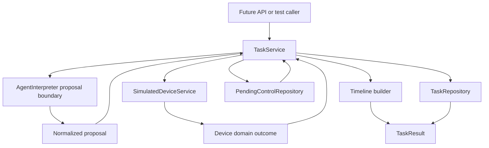
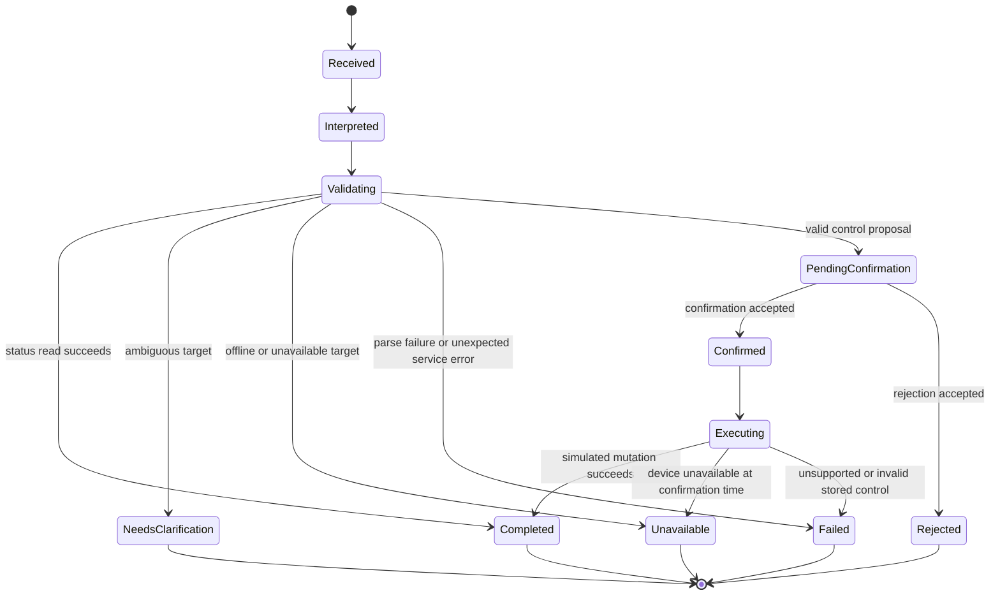
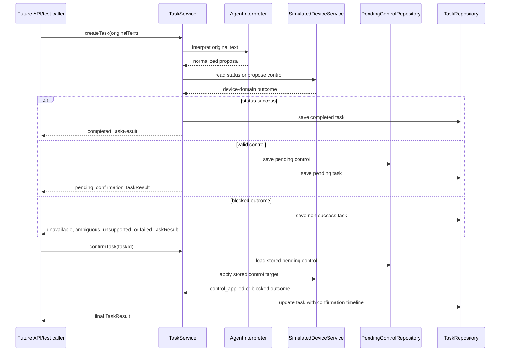

# feat: Detail Task Lifecycle Confirmation Service

## Summary

Build the task lifecycle, timeline, and confirmation service slice for the Agent Plan Contract service. This plan details only the parent plan's `U3. Task Lifecycle, Timeline, And Confirmation Service`: service-owned task records, normalized interpreter proposals, deterministic timeline events, pending-control storage, confirmation/rejection transitions, and mapping from simulated device outcomes into public task results.

---

## Problem Frame

U1 established the public task/device contracts, and U2 established a provider-neutral simulated device domain. The next slice must connect those pieces without introducing HTTP routes or LangChain runtime behavior: a task service should accept an interpreted intent proposal, validate it through the simulated device service, persist an inspectable task record, and return a contract-shaped result with attributable timeline events.

The important product constraint is confirmation. A control request may be recognized and validated, but it must not mutate simulated state until a later confirmation call operates on the stored pending control. Rejecting, ignoring, or confirming an invalid pending control must leave state unchanged and produce an auditable task outcome.

---

## Requirements

**Task Records And Public Results**

- R1. The service creates stable task records with task id, original text, classification, execution state, selected context, reply, structured plan, and ordered timeline. Origin: R1-R4, R17-R19.
- R2. Task records are inspectable after creation and after confirmation/rejection transitions without depending on Fastify or LangChain internals. Origin: R3, R19, R26-R27.
- R3. Public task results remain Zod-validated and provider-neutral, with no LangChain messages, tool-call objects, run objects, or raw provider payloads as client-facing fields. Origin: R24-R27.

**Interpreter Proposal Normalization**

- R4. The task service consumes normalized interpreter proposals as untrusted suggestions and validates all selected devices, data items, control items, and requested values through service-owned domain code. Origin: R24, R28.
- R5. Status-query, control-request, ambiguous, unsupported, unavailable, not-found, invalid-value, and parse-failure paths map into first-class task outcomes with machine-readable reason details and timeline attribution. Origin: R2, R7-R8, R13, R17-R18.

**Confirmation Lifecycle**

- R6. Valid control requests create pending controls with confirmation summaries, expected effects, target control data, creation time, and optional expiry; simulated state remains unchanged while pending. Origin: R9-R10, R12, R23, AE3.
- R7. Confirming a pending control applies simulated state mutation only after pending-control validation succeeds. Origin: R11, R16, F4, AE2.
- R8. Rejecting a pending control records rejection and leaves simulated state unchanged. Origin: R12, AE3.
- R9. Missing, expired, already confirmed, already rejected, unavailable, unsupported, and invalid pending controls return non-success outcomes without mutation. Origin: R8, R12-R13, R15, F5.

**Timeline And Observability**

- R10. Every task records meaningful stages for request receipt, model interpretation, service validation, device resolution, simulated read or confirmation-required, confirmation-received when applicable, simulated execution when applicable, and final outcome. Origin: R17.
- R11. Timeline events distinguish client, model, service, and simulated-device sources so interpretation, validation, and device failures remain attributable. Origin: R18.
- R12. Timeline timestamps and IDs are deterministic under an injected clock/id generator in tests. Origin: R19 and parent R8-R9.

---

## Key Technical Decisions

- KTD1. Keep U3 framework-independent: expose task-domain services and repositories under `src/domain/tasks/`; Fastify routes consume this service later in parent U5.
- KTD2. Introduce a normalized `AgentInterpreter` proposal type only as an input boundary for U3 tests: the LangChain adapter will implement the same boundary later, but U3 should use fake proposals and never import LangChain packages.
- KTD3. Store canonical task records as complete `TaskResult` snapshots plus minimal internal pending-control metadata: this preserves inspection semantics while avoiding a second public result model.
- KTD4. Add a small contract field for machine-readable task outcome reasons if implementation confirms the gap: `executionState` is not enough to distinguish offline, unsupported, ambiguous, not-found, invalid-value, expired, duplicate, and rejected cases without parsing prose.
- KTD5. Use repository interfaces backed by in-memory implementations: V1 needs consistent state within one process, while later persistence can replace repositories without changing service behavior.
- KTD6. Centralize timeline creation in a builder/factory: stage/source/status vocabulary already lives in `src/contracts/task-contract.ts`, so service code should append validated events rather than hand-build divergent event objects.
- KTD7. Confirmations operate on stored pending controls, not a fresh interpreter call: the original validated target is the authority for mutation, which prevents model drift between request and confirmation.
- KTD8. Treat device-domain outcomes as the only mutation/read authority: U3 maps `SimulatedDeviceService` results into task states and replies instead of reimplementing resolver or store logic.

---

## High-Level Technical Design



The task service owns public task semantics. Interpreter proposals describe likely intent; device-domain outcomes describe simulated device facts; repositories preserve task and pending-control state; the timeline builder records the attribution for each decision.





---

## Output Structure

```text
src/
├── agent/
│   └── agent-interpreter.ts
└── domain/
    └── tasks/
        ├── pending-control-repository.ts
        ├── task-repository.ts
        ├── task-service.ts
        ├── task-types.ts
        └── timeline.ts
tests/
├── domain/
│   └── tasks/
│       ├── pending-control-repository.test.ts
│       ├── task-repository.test.ts
│       ├── task-service-confirmation.test.ts
│       ├── task-service-outcomes.test.ts
│       └── timeline.test.ts
└── fixtures/
    └── task-fixtures.ts
```

The exact filenames can shift during implementation, but the boundaries should remain: interpreter boundary, task service, task repository, pending-control repository, timeline factory, and task-domain tests.

---

## Implementation Units

### U1. Task Outcome Contract Gap And Fixtures

- **Goal:** Tighten the public task contract where needed so task results can carry machine-readable non-success reasons while staying provider-neutral.
- **Requirements:** R1, R3, R5, R9; origin R2, R7-R8, R13, R17-R18, R24-R27.
- **Dependencies:** Parent U1.
- **Files:** `src/contracts/task-contract.ts`, `tests/contracts/task-contract.test.ts`, `tests/fixtures/contract-fixtures.ts`, `docs/contracts/agent-plan-contract.md`.
- **Approach:** Review the existing `TaskResult` schema before changing it. If `executionState`, `classification`, selected context, and timeline cannot distinguish blocked outcomes without parsing prose, add a narrow `outcomeReason` or equivalent enum covering device and confirmation reasons. Keep pending-control invariants intact: `pendingControl` remains valid only while `executionState` is `pending_confirmation`.
- **Execution note:** Add failing contract tests for offline, unsupported, ambiguous, expired, duplicate-confirmation, and rejected outcomes before changing the schema.
- **Patterns to follow:** Existing Zod schema style in `src/contracts/task-contract.ts`; existing fixture-driven contract tests in `tests/contracts/task-contract.test.ts`.
- **Test scenarios:**
  - An offline control task result validates with a machine-readable device-offline reason and no pending control.
  - An ambiguous task result validates with candidate context and an ambiguity reason without selected executable actions.
  - Unsupported and invalid-value task results validate with distinct reasons while remaining provider-neutral.
  - A rejected task result validates without `pendingControl` and with rejection reason/timeline attribution.
  - Duplicate or expired confirmation results validate as non-success task outcomes without mutation markers.
  - Existing status-query and pending-control fixtures remain valid after any schema extension.
- **Verification:** Contract tests prove every first-class blocked outcome can be asserted without string-matching `reply` or timeline `detail`.

### U2. Interpreter Proposal Boundary For Task Service

- **Goal:** Define the normalized proposal input U3 expects from fake or future LangChain interpreters.
- **Requirements:** R3, R4, R5; origin R24-R28.
- **Dependencies:** U1.
- **Files:** `src/agent/agent-interpreter.ts`, `src/domain/tasks/task-types.ts`, `tests/fixtures/task-fixtures.ts`, `tests/domain/tasks/task-service-outcomes.test.ts`.
- **Approach:** Define a framework-neutral interface that accepts original text plus available context and returns a discriminated proposal: status query, control request, ambiguous request, unsupported request, or parse failure. Proposal targets should use existing device-domain target fields such as room, device type, device name, capability, data item, control item, phrase, and requested value. Do not add LangChain messages, tool-call IDs, or provider metadata to this interface.
- **Technical design:** Directional proposal vocabulary: `status_query` carries a read target; `control_request` carries a control target and requested value; `ambiguous` carries reason and optional candidates from interpreter-level uncertainty; `unsupported` carries reason; `parse_failure` carries validation detail for service-side failure handling.
- **Patterns to follow:** Device target vocabulary in `src/domain/devices/device-types.ts`; provider-neutral contract boundary in `docs/contracts/agent-plan-contract.md`.
- **Test scenarios:**
  - A fake status proposal can be passed into the task service without importing LangChain code.
  - A fake control proposal carries enough target information to call `SimulatedDeviceService.proposeControl`.
  - Ambiguous, unsupported, and parse-failure proposals map to non-executable task outcomes with no selected control items.
  - Proposal validation rejects missing requested value on control requests and incompatible mixed intents.
  - Proposal fixtures contain no `messages`, `tool_calls`, `run`, or provider response fields.
- **Verification:** U3 tests can exercise all task-service branches with deterministic fake proposals while parent U4 remains free to implement LangChain behind the same boundary.

### U3. Timeline Builder

- **Goal:** Add a reusable timeline event builder that creates ordered, schema-valid events with deterministic IDs and timestamps.
- **Requirements:** R10, R11, R12; origin R17-R18.
- **Dependencies:** U1.
- **Files:** `src/domain/tasks/timeline.ts`, `tests/domain/tasks/timeline.test.ts`.
- **Approach:** Centralize event creation around injected clock and ID generator dependencies. Provide small helpers for the standard lifecycle stages, but keep the output as public `TimelineEvent` values from `src/contracts/task-contract.ts`. The builder should make it hard to omit model/service/simulated-device attribution or emit invalid stage/source/status combinations.
- **Patterns to follow:** `timelineStageSchema`, `timelineSourceSchema`, and `timelineStatusSchema` in `src/contracts/task-contract.ts`; fixture timeline shape in `tests/fixtures/contract-fixtures.ts`.
- **Test scenarios:**
  - Creating request, interpretation, validation, device-resolution, simulated-read, confirmation-required, confirmation-received, simulated-execution, and final-outcome events produces schema-valid timeline events.
  - Injected clock and ID generator produce deterministic `at` and `eventId` values in order.
  - Status-query timelines include model interpretation, service validation, simulated read, and final outcome with distinct sources.
  - Pending-control timelines include `confirmation_required` with waiting status and do not include `simulated_execution`.
  - Confirmed-control timelines append `confirmation_received`, `simulated_execution`, and final outcome after the original pending timeline.
  - Rejected-control timelines append `confirmation_received` and final rejected outcome without simulated execution.
- **Verification:** Task service tests can assert timeline stages and sources without duplicating event construction details.

### U4. In-Memory Task Repository

- **Goal:** Persist inspectable task records within one service process.
- **Requirements:** R1, R2, R12; origin R3, R19.
- **Dependencies:** U1, U3.
- **Files:** `src/domain/tasks/task-repository.ts`, `tests/domain/tasks/task-repository.test.ts`.
- **Approach:** Define a repository interface with create/save, get by task id, update, and list or debug inspection only if needed by tests. The in-memory implementation should snapshot records on read/write so callers cannot mutate stored task results accidentally. ID generation should be injectable at the task service level rather than hidden inside the repository.
- **Patterns to follow:** Snapshot discipline in `src/domain/devices/simulated-device-store.ts`.
- **Test scenarios:**
  - Saving a completed status task makes it retrievable by task id.
  - Updating a pending task after confirmation replaces the stored execution state and timeline.
  - Unknown task id returns a not-found repository result instead of throwing for normal lookup.
  - Mutating a retrieved task object does not mutate the stored record.
  - Saving invalid task-result objects is rejected or prevented through schema validation.
- **Verification:** Task inspection and later confirmation flows can rely on stable stored task results independent of HTTP routing.

### U5. In-Memory Pending-Control Repository

- **Goal:** Store pending-control metadata and enforce pending, confirmed, rejected, expired, and missing states.
- **Requirements:** R6, R7, R8, R9, R12; origin R9-R13, R23, AE2-AE3.
- **Dependencies:** U1, U3.
- **Files:** `src/domain/tasks/pending-control-repository.ts`, `tests/domain/tasks/pending-control-repository.test.ts`.
- **Approach:** Store pending controls separately from task records so confirmation can validate lifecycle state before mutation. Each record should include pending control id, task id, selected control target, confirmation summary, expected effect, created time, optional expiry, and status. Confirm/reject operations should be compare-and-transition style to prevent duplicate mutation.
- **Technical design:** Directional pending states: `pending` can transition to `confirmed` or `rejected`; `expired` is derived from clock at validation time or stored when first observed; terminal states cannot transition again.
- **Patterns to follow:** Existing `PendingControl` contract in `src/contracts/task-contract.ts`; clock injection pattern from device store tests.
- **Test scenarios:**
  - Creating a pending control stores target, task id, confirmation summary, expected effect, and expiry.
  - Loading by task id or pending control id returns a snapshot that cannot mutate repository state.
  - Confirming a pending control transitions it to confirmed exactly once.
  - Rejecting a pending control transitions it to rejected exactly once.
  - Confirming rejected, already confirmed, missing, or expired controls returns a non-success repository outcome.
  - Expired pending controls do not become executable and remain safe under repeated confirm attempts.
- **Verification:** Confirmation service logic can distinguish missing, expired, duplicate, and rejected controls before touching simulated devices.

### U6. Task Service Status And Blocked Outcomes

- **Goal:** Implement task creation for status queries and non-control blocked outcomes.
- **Requirements:** R1, R2, R3, R4, R5, R10, R11, R12; origin R1-R8, R13, R17-R19, R24-R28, F1-F2, F5, AE1, AE4-AE5.
- **Dependencies:** U1-U4 and parent U2.
- **Files:** `src/domain/tasks/task-service.ts`, `src/domain/tasks/task-types.ts`, `tests/domain/tasks/task-service-outcomes.test.ts`, `tests/fixtures/task-fixtures.ts`.
- **Approach:** `createTask` should record request receipt, invoke the interpreter boundary, validate the proposal, call `SimulatedDeviceService.readStatus` for status proposals, and map domain outcomes to task results. Ambiguous, not-found, unavailable, unsupported, invalid proposal, and parse-failure cases should persist inspectable task records with selected context and attributable timeline.
- **Patterns to follow:** Device-domain service facade in `src/domain/devices/simulated-device-service.ts`; existing fixture examples in `tests/fixtures/contract-fixtures.ts`.
- **Test scenarios:**
  - Covers F1 / AE1. A living-room air-conditioner status proposal creates a completed task with selected device/data items, reply, plan steps, and timeline stages for interpretation, validation, simulated read, and final outcome.
  - Covers F2 / AE5. A vague bedroom-device status proposal returns `needs_clarification`, includes candidate devices, records service validation as blocked, and does not select control items.
  - Covers F5 / AE4. An offline kitchen-light status proposal returns `unavailable`, includes device context and simulated-device attribution, and records no mutation.
  - Unsupported data-item and not-found proposals produce non-success task results with distinct reasons and no pending control.
  - Interpreter parse failure produces a failed task result with model interpretation failure and service final-outcome failure.
  - Every returned task result parses through `taskResultSchema` and is retrievable from `TaskRepository`.
- **Verification:** Status and blocked key flows run through domain calls only, without Fastify, LangChain, or live network access.

### U7. Task Service Pending Control Creation

- **Goal:** Implement task creation for valid and blocked control requests before confirmation.
- **Requirements:** R1, R2, R3, R4, R5, R6, R9, R10, R11, R12; origin R9-R13, R17-R19, R23-R28, F3, F5, AE3-AE4.
- **Dependencies:** U1-U6 and parent U2.
- **Files:** `src/domain/tasks/task-service.ts`, `tests/domain/tasks/task-service-confirmation.test.ts`, `tests/fixtures/task-fixtures.ts`.
- **Approach:** For control proposals, call `SimulatedDeviceService.proposeControl` and create a pending-control record only when the device-domain result is `control_proposed`. Build a confirmation summary and expected effect from device-domain output, persist the pending task result, and record `confirmation_required` without `simulated_execution`. Blocked control outcomes should not create pending controls.
- **Patterns to follow:** Non-mutation guarantee in `src/domain/devices/simulated-device-service.ts`; pending-control contract in `src/contracts/task-contract.ts`.
- **Test scenarios:**
  - Covers F3 / AE3. A hallway-light power control creates a pending task, stores a pending-control record, returns confirmation summary and expected effect, and leaves the light state unchanged.
  - Pending-control task results include selected control item and selected device context but no simulated execution timeline event.
  - Offline control returns unavailable and does not create a pending-control record.
  - Read-only sensor control returns unsupported or read-only and does not create a pending-control record.
  - Invalid control value returns a non-success task outcome and preserves simulated state.
  - Ambiguous control target returns clarification with candidates and no pending-control record.
- **Verification:** Control creation proves confirmation is required before mutation and that blocked controls cannot later be confirmed.

### U8. Confirmation And Rejection Service Transitions

- **Goal:** Implement confirmation and rejection operations that update task records and apply simulated mutation only when valid.
- **Requirements:** R2, R3, R7, R8, R9, R10, R11, R12; origin R3, R11-R13, R16-R19, F4-F5, AE2-AE3.
- **Dependencies:** U1-U7 and parent U2.
- **Files:** `src/domain/tasks/task-service.ts`, `tests/domain/tasks/task-service-confirmation.test.ts`, `tests/fixtures/task-fixtures.ts`.
- **Approach:** Add service methods that confirm or reject by task id or pending control id. Confirmation validates pending-control state, appends confirmation timeline events, calls `SimulatedDeviceService.applyControl` with the stored target, maps the device outcome, updates task/pending repositories, and returns the final task result. Rejection appends rejection timeline events and terminally marks the pending control without mutation.
- **Technical design:** Directional confirmation rule: repository lifecycle validation happens before device mutation; device mutation result decides final execution state; repository terminal state is updated only once per valid transition.
- **Patterns to follow:** `SimulatedDeviceStore.applyControl` mutation behavior and current pending-control fixture semantics.
- **Test scenarios:**
  - Covers F4 / AE2. Confirming a pending hallway-light control applies mutation, returns completed task result, appends `confirmation_received`, `simulated_execution`, and final outcome events, and a later status task reads the light as on.
  - Covers AE3. Rejecting a pending control returns rejected task result, appends confirmation/rejection timeline evidence, and leaves light state unchanged.
  - Confirming a missing task or pending control returns a failed or unavailable-like task-service outcome without device mutation.
  - Confirming an expired pending control returns a non-success outcome, marks the lifecycle non-executable, and leaves state unchanged.
  - Confirming an already confirmed pending control is idempotently blocked and does not apply mutation twice.
  - Confirming an already rejected pending control returns rejected/non-success outcome and does not apply mutation.
  - If the device becomes unavailable at confirmation time, the task returns unavailable, appends simulated-device blocked attribution, and does not report success.
- **Verification:** Full confirmation and rejection flows are deterministic, inspectable, mutation-safe, and covered without HTTP or live model dependencies.

### U9. End-To-End Domain Regression Fixtures

- **Goal:** Encode the origin key flows as task-domain regression tests and reusable fixtures for later API and agent-adapter units.
- **Requirements:** R1-R12; origin F1-F5, AE1-AE5, R28.
- **Dependencies:** U1-U8.
- **Files:** `tests/domain/tasks/task-service-outcomes.test.ts`, `tests/domain/tasks/task-service-confirmation.test.ts`, `tests/fixtures/task-fixtures.ts`, `docs/contracts/agent-plan-contract.md`.
- **Approach:** Build a fake interpreter fixture layer that returns proposal sequences for air-conditioner status, hallway-light control, ambiguous bedroom request, offline kitchen-light control, unsupported sensor write, and parse failure. Keep these fixtures independent from LangChain so parent U4 can later prove adapter parity against the same expected task outcomes.
- **Patterns to follow:** Existing domain fixture discipline in `tests/fixtures/contract-fixtures.ts`; parent plan acceptance examples.
- **Test scenarios:**
  - Covers F1 / AE1. Status lookup for the living-room air conditioner returns selected power, mode, target temperature, and room temperature.
  - Covers F3 / AE3. Unconfirmed hallway-light control remains pending and does not mutate state across repeated reads.
  - Covers F4 / AE2. Confirmed hallway-light control mutates state and the later task result reflects the new value.
  - Covers F2 / AE5. Ambiguous bedroom-device request returns clarification with candidates and no mutation.
  - Covers F5 / AE4. Offline kitchen-light control is blocked and leaves simulated state unchanged.
  - Unsupported read-only sensor control and invalid control value remain first-class non-success outcomes.
  - Every final task result from the regression suite validates through `taskResultSchema` and contains no provider-specific fields.
- **Verification:** Parent acceptance examples are fully represented at the task-domain layer before Fastify routes or LangChain adapters are introduced.

---

## Acceptance Examples

- AE1. Air-conditioner status task completes: a fake status proposal for the living-room air conditioner returns a completed task with selected data items, reply, plan, and timeline attribution.
- AE2. Control task waits: a fake hallway-light control proposal creates a pending control and leaves simulated state unchanged.
- AE3. Confirmed control mutates: confirming the stored hallway-light pending control applies the power change and a later status task reads the updated value.
- AE4. Rejected or ignored control does not mutate: rejecting the stored pending control returns a rejected task result and leaves the original device state intact.
- AE5. Ambiguity and unavailable outcomes are first-class: vague bedroom requests and offline kitchen-light controls return non-success task results with candidates or unavailable context and no pending executable action.
- AE6. Invalid confirmation attempts are safe: missing, expired, already confirmed, and already rejected pending controls return non-success outcomes without applying simulated mutation.

---

## Scope Boundaries

### In Scope

- Task-domain types, interpreter proposal boundary, timeline builder, task repository, pending-control repository, task service lifecycle mapping, confirmation/rejection transitions, contract gap-fill if needed, task-domain fixtures, and offline tests.

### Deferred To Follow-Up Work

- Fastify app construction, HTTP request/response validation, route error shaping, and API integration tests from the parent plan's API unit.
- Fake interpreter implementation intended for application wiring, LangChain DeepSeek adapter, prompts, structured model output, and tool wrappers from the parent plan's agent-adapter unit.
- README runbook, curl examples, live DeepSeek smoke tests, and broader end-to-end documentation from the parent plan's regression/documentation unit.
- Persistent database storage, production audit retention, real permissions, household sharing, and real IoT adapter mutation.

### Outside This Product's Identity For V1

- Fully automatic device control without confirmation.
- Voice input/output, wake words, streaming, ASR, or TTS.
- Real IoT platform state mutation.

---

## System-Wide Impact

This slice establishes the service-owned lifecycle boundary that later API and LangChain units must respect. The main system effect is that public task semantics become independent from both the model provider and the HTTP layer: routes will call a task service, and adapters will provide proposals, but neither owns confirmation, mutation safety, task persistence, or timeline truth.

---

## Risks And Dependencies

- **Contract drift:** Task service output can drift from Zod fixtures. Mitigation: every service result test should parse through `taskResultSchema`, and contract gap-fill must happen before task-service mapping.
- **Reason under-modeling:** If blocked outcomes are only prose, later API/client tests will be brittle. Mitigation: add a narrow machine-readable outcome reason if contract review confirms the current schema cannot express these branches.
- **Duplicate mutation:** Confirmation retries can apply the same control twice if pending-state transitions are not terminal. Mitigation: repository transition checks must run before `SimulatedDeviceService.applyControl`.
- **Model/service boundary leakage:** U3 could overfit to future LangChain adapter shapes. Mitigation: keep proposals provider-neutral and test through fake proposal fixtures.
- **Timeline noise:** Overly granular events can make results hard to inspect. Mitigation: use one event per meaningful stage from the origin requirements and keep detail text concise.
- **Device state race within V1:** In-memory state is single-process and not concurrency-hardened. Mitigation: make repository transitions atomic within the in-memory abstraction and defer distributed locking to future persistence work.

---

## Documentation And Operational Notes

- Update `docs/contracts/agent-plan-contract.md` only for public contract changes or to clarify confirmation lifecycle semantics discovered while implementing U3.
- Do not document HTTP routes in this slice; route shape belongs to the parent plan's Fastify API unit.
- Keep fake proposal fixtures in tests as reusable assets for parent U4 and U5.

---

## Sources And Research

- Parent plan: `docs/plans/2026-06-07-001-feat-agent-plan-contract-service-plan.md`.
- Origin requirements: `docs/brainstorms/2026-06-06-agent-plan-contract-requirements.md`.
- Prior child plan for contracts: `docs/plans/2026-06-07-002-feat-project-scaffold-contracts-plan.md`.
- Prior child plan for device domain: `docs/plans/2026-06-07-003-feat-simulated-device-domain-plan.md`.
- Public schemas: `src/contracts/task-contract.ts`, `src/contracts/device-contract.ts`.
- Simulated device domain: `src/domain/devices/simulated-device-service.ts`, `src/domain/devices/device-results.ts`, `src/domain/devices/device-types.ts`, `src/domain/devices/simulated-device-store.ts`.
- Existing tests and fixtures: `tests/contracts/task-contract.test.ts`, `tests/domain/devices/simulated-device-service.test.ts`, `tests/domain/devices/device-domain-contract.test.ts`, `tests/fixtures/contract-fixtures.ts`.
