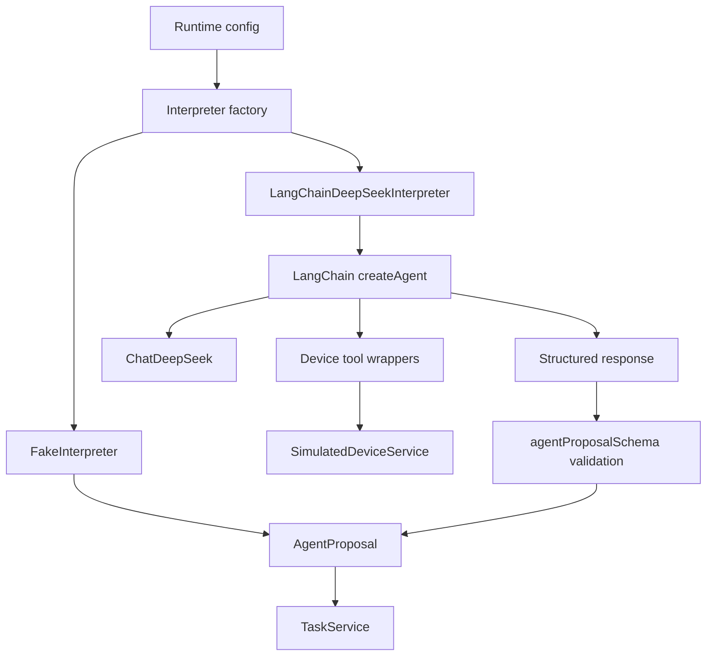
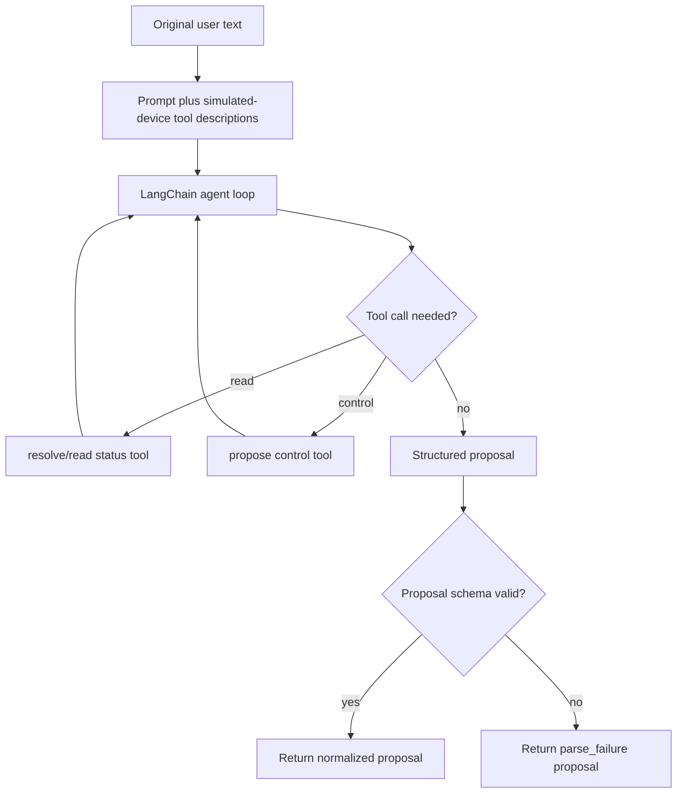
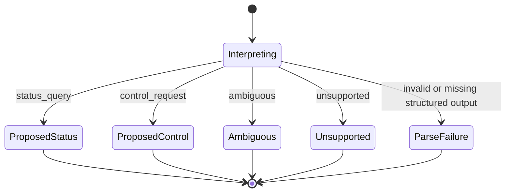

# feat: Detail LangChain DeepSeek Interpreter Adapter

## Summary

Build the interpreter slice for the Agent Plan Contract service. This plan details only the parent plan's `U4. LangChain DeepSeek Interpreter Adapter`: deterministic fake interpretation, LangChain DeepSeek wiring, prompt and structured proposal schemas, domain-level simulated-device tools, offline adapter contract tests, sample utterance regression, and opt-in live DeepSeek smoke validation.

---

## Problem Frame

U1 established provider-neutral public contracts, U2 established the simulated device domain, and U3 established `TaskService` around a normalized `AgentInterpreter` proposal boundary. U4 must make that boundary useful for both deterministic local validation and live DeepSeek experiments without letting LangChain objects become the task contract.

The product constraint from the origin remains unchanged: LangChain can suggest intent and use domain-level tools, but service-owned code validates task semantics, creates pending controls, records timeline, and mutates simulated state only after confirmation.

---

## Requirements

**Interpreter Boundary**

- R1. The adapter implements the existing `AgentInterpreter` interface and returns only normalized `AgentProposal` values. Origin: R24-R28.
- R2. Public task results and task-service code do not depend on LangChain messages, run objects, tool-call objects, or raw DeepSeek payloads. Origin: R24-R27.
- R3. Malformed, missing, multi-intent, or schema-invalid model output becomes a `parse_failure` proposal rather than leaking provider errors into task semantics. Origin: R24, R28.

**Deterministic Local Behavior**

- R4. Fake interpreter mode covers representative status, control, ambiguous, unsupported, offline, and parse-failure utterances without network access or DeepSeek credentials. Origin: R28 and parent R8-R9.
- R5. Sample utterance fixtures are reusable by task-service and later API/e2e tests so regression coverage stays aligned across layers. Origin: AE1-AE5.

**LangChain DeepSeek Integration**

- R6. Live mode constructs a LangChain agent with `ChatDeepSeek`, the configured model, domain-level device tools, and a Zod-backed response format for structured proposals.
- R7. LangChain tools expose simulated-device resolution, status reads, and control proposals; they do not apply controls or create pending controls. Origin: R9-R13, R23-R25.
- R8. The prompt steers the model toward the existing proposal vocabulary and keeps JSON/structured output requirements explicit enough for DeepSeek JSON output behavior.
- R9. Optional live DeepSeek smoke validation is skipped by default when credentials are absent and never belongs to the normal offline test suite. Origin: R28.

---

## Key Technical Decisions

- KTD1. Keep `src/agent/agent-interpreter.ts` as the canonical interface: U4 may extend schema helpers, but it should not move task validation or device mutation out of `TaskService`.
- KTD2. Implement fake mode as a rule-based interpreter, not a test-only queued stub: queued interpreters already exist in `tests/fixtures/task-fixtures.ts`; runtime fake mode needs deterministic behavior from text so developers can run the service locally.
- KTD3. Use LangChain `createAgent` with a Zod `responseFormat`: local `langchain@1.4.4` types and current docs support `structuredResponse`, which is the cleanest boundary before `parseAgentProposal`.
- KTD4. Wrap LangChain creation behind a small factory: mocked adapter tests should inject an agent-like invoker and avoid real DeepSeek, while production code uses `ChatDeepSeek` from `@langchain/deepseek`.
- KTD5. Tool wrappers return domain facts, not command execution: `readStatus` and `proposeControl` may inspect simulated state, but only the confirmation service may call `applyControl`.
- KTD6. Treat LangChain output as untrusted even after structured output: `structuredResponse` still parses through `agentProposalSchema`, and known LangChain parsing failures map to `parse_failure`.
- KTD7. Keep LangGraph out of this slice: plain LangChain plus service-owned pending controls covers V1; durable human-in-the-loop orchestration remains deferred.

---

## High-Level Technical Design



The factory chooses fake or DeepSeek mode from configuration. Both branches return the same `AgentInterpreter` interface, so `TaskService` continues to validate proposals and map them into task outcomes without knowing which interpreter produced them.



The tools can help the model select the correct simulated context, but the returned proposal remains a suggestion. Control proposals never execute simulated mutation in this adapter path.



---

## Output Structure

```text
src/
└── agent/
    ├── agent-factory.ts
    ├── agent-interpreter.ts
    ├── agent-prompts.ts
    ├── agent-schemas.ts
    ├── device-tools.ts
    ├── fake-interpreter.ts
    └── langchain-deepseek-interpreter.ts
tests/
├── agent/
│   ├── agent-factory.test.ts
│   ├── device-tools.test.ts
│   ├── fake-interpreter.test.ts
│   ├── langchain-adapter-contract.test.ts
│   └── langchain-live-smoke.test.ts
└── fixtures/
    └── sample-utterances.ts
```

The exact filenames may shift during implementation, but the boundary should remain: proposal schemas, prompt text, fake interpreter, LangChain adapter, device tools, factory, and tests stay separate.

---

## Implementation Units

### U1. Proposal Schema Module And Fixtures

- **Goal:** Split reusable proposal schema helpers and sample utterance fixtures out of the current interpreter boundary without changing `TaskService` semantics.
- **Requirements:** R1, R2, R3, R5; origin R24-R28, AE1-AE5.
- **Dependencies:** Parent U1-U3.
- **Files:** `src/agent/agent-interpreter.ts`, `src/agent/agent-schemas.ts`, `tests/fixtures/sample-utterances.ts`, `tests/agent/langchain-adapter-contract.test.ts`.
- **Approach:** Preserve `AgentInterpreter`, `AgentProposal`, and `parseAgentProposal` exports for existing imports. Move or re-export schema details through `agent-schemas` only if it reduces duplication for prompt response-format and tests. Add shared utterance cases for air-conditioner status, hallway light on, unconfirmed control, offline kitchen light, vague bedroom device, unsupported sensor write, and nonsensical input.
- **Patterns to follow:** Current `src/agent/agent-interpreter.ts`; proposal fixtures in `tests/fixtures/task-fixtures.ts`; task-service expectations in `tests/domain/tasks/task-service-outcomes.test.ts`.
- **Test scenarios:**
  - Existing `TaskService` tests still import and parse `AgentProposal` without code changes outside the agent boundary.
  - Sample utterance fixtures include expected proposal kinds and target hints for status, control, ambiguous, unsupported, offline, and parse-failure cases.
  - Schema validation rejects missing control `requestedValue`, missing status target selector, unknown proposal kind, and multiple incompatible intent payloads.
  - Proposal fixtures contain no LangChain `messages`, `tool_calls`, run ids, or raw DeepSeek response payloads.
- **Verification:** The proposal schema remains the single normalized adapter output contract, and existing task-domain tests still compile against it.

### U2. Runtime Fake Interpreter

- **Goal:** Implement a deterministic fake interpreter for local service mode and offline regression tests.
- **Requirements:** R1, R2, R4, R5; origin R24-R28, AE1-AE5.
- **Dependencies:** U1.
- **Files:** `src/agent/fake-interpreter.ts`, `tests/agent/fake-interpreter.test.ts`, `tests/fixtures/sample-utterances.ts`.
- **Approach:** Map representative text phrases into normalized proposals using simple, inspectable rules. Keep the runtime fake interpreter separate from queued test doubles so developer-facing fake mode behaves from actual text. It should intentionally cover only the V1 examples and return `unsupported` or `parse_failure` for unknown text rather than guessing.
- **Patterns to follow:** Device target vocabulary in `src/domain/devices/device-types.ts`; existing queued helpers in `tests/fixtures/task-fixtures.ts` for deterministic test setup.
- **Test scenarios:**
  - Covers AE1. Air-conditioner status utterance returns a `status_query` target for living-room air conditioner status.
  - Covers AE2 and AE3. Hallway-light on utterance returns a `control_request` with power set to true and no execution claim.
  - Covers AE4. Offline kitchen-light control utterance returns a control proposal that the task service can later downgrade through simulated-device validation.
  - Covers AE5. Vague bedroom-device utterance returns an ambiguous proposal or a target broad enough for the task service to return ambiguity.
  - Unsupported sensor write maps to a control proposal only if it exercises read-only validation, otherwise to `unsupported` with a stable reason.
  - Nonsensical text returns `parse_failure` with a concise reason.
- **Verification:** Developers can use fake interpreter mode without credentials and still exercise the origin acceptance examples through `TaskService`.

### U3. Device Tool Wrappers

- **Goal:** Expose simulated-device domain operations as LangChain-compatible tools that can resolve/read status and propose controls without mutation.
- **Requirements:** R2, R6, R7; origin R9-R13, R23-R25.
- **Dependencies:** U1 and parent U2.
- **Files:** `src/agent/device-tools.ts`, `tests/agent/device-tools.test.ts`.
- **Approach:** Create tool wrappers around `SimulatedDeviceService.readStatus`, `SimulatedDeviceService.proposeControl`, and a read-only debug/candidate operation when useful for interpretation. Tool input schemas should mirror `DeviceTarget` and `ControlTarget` concepts. Tool output should be compact, JSON-serializable domain facts that help the model form a proposal, not public `TaskResult` objects.
- **Technical design:** Directional tool set: a status-read tool returns selected device/data facts or blocked outcome facts; a control-proposal tool returns selected control facts, expected effect, or blocked outcome facts; an optional snapshot/candidate tool returns a limited simulated catalog summary for disambiguation.
- **Patterns to follow:** `src/domain/devices/simulated-device-service.ts`; result unions in `src/domain/devices/device-results.ts`; no-mutation guarantee from device service tests.
- **Test scenarios:**
  - Status tool returns air-conditioner selected values for living-room status input.
  - Control-proposal tool returns hallway-light selected control and expected effect while leaving later reads unchanged.
  - Offline, ambiguous, unsupported, and invalid-value device outcomes serialize as blocked tool results with stable reason fields.
  - Tool wrappers never call `applyControl` and cannot mutate simulated state through proposed controls.
  - Tool output omits LangChain-specific metadata and remains JSON-serializable.
- **Verification:** LangChain can call domain-level tools during interpretation, and all tool behavior remains provider-neutral and mutation-safe.

### U4. Prompt And Structured Output Contract

- **Goal:** Define prompt text and LangChain response-format schema that guide DeepSeek toward the normalized proposal vocabulary.
- **Requirements:** R1, R2, R3, R6, R8; origin R24-R28.
- **Dependencies:** U1, U3.
- **Files:** `src/agent/agent-prompts.ts`, `src/agent/agent-schemas.ts`, `tests/agent/langchain-adapter-contract.test.ts`.
- **Approach:** Keep prompt content in a separate module so it is inspectable and testable. The prompt should name supported task kinds, the confirmation boundary, no-mutation rule, ambiguity behavior, and JSON/structured-output expectation. Response schema should be compatible with `agentProposalSchema` and avoid fields the task service will ignore.
- **Patterns to follow:** Contract language in `docs/contracts/agent-plan-contract.md`; origin technical direction that LangChain output is a proposal.
- **Test scenarios:**
  - Prompt text includes the supported proposal kinds and the instruction that controls are proposed, not executed.
  - Prompt text instructs ambiguity handling instead of silent guessing.
  - Response schema accepts valid status, control, ambiguous, unsupported, and parse-failure proposals used by sample utterances.
  - Response schema rejects provider metadata, unknown proposal kinds, missing selectors, and invalid control values before the adapter returns to `TaskService`.
  - DeepSeek JSON-output guidance is represented in prompt or adapter configuration so live mode has a clear structured-output instruction.
- **Verification:** The adapter has an inspectable prompt/schema contract that aligns with `AgentInterpreter` and the public Agent Plan Contract.

### U5. LangChain DeepSeek Adapter

- **Goal:** Implement the live interpreter adapter around LangChain `createAgent`, `ChatDeepSeek`, structured output, device tools, and proposal normalization.
- **Requirements:** R1, R2, R3, R6, R7, R8, R9; origin R24-R28.
- **Dependencies:** U1, U3, U4 and parent U2-U3.
- **Files:** `src/agent/langchain-deepseek-interpreter.ts`, `tests/agent/langchain-adapter-contract.test.ts`.
- **Approach:** Build the adapter so tests can inject an agent-like invoker returning mocked `structuredResponse` values or throwing LangChain-style errors. Production construction should instantiate `ChatDeepSeek` with configured `apiKey` and `model`, build the agent with device tools and response format, invoke it with the user text, and pass `structuredResponse` through `parseAgentProposal`.
- **Technical design:** Directional adapter contract: input text enters the LangChain agent; the adapter reads only structured proposal output; validation success returns a proposal; validation or agent parsing failure returns `parse_failure`; unexpected runtime errors either return `parse_failure` or rethrow only if they represent construction-time misconfiguration.
- **Patterns to follow:** Current `parseAgentProposal` behavior in `src/agent/agent-interpreter.ts`; `parseEnv` live-mode guard in `src/config/env.ts`; local `@langchain/deepseek` README constructor shape.
- **Test scenarios:**
  - Mocked structured status response returns the same `status_query` proposal shape used by fake interpreter fixtures.
  - Mocked structured control response returns the same `control_request` proposal shape and does not mutate simulated state.
  - Missing `structuredResponse`, invalid schema, or multiple incompatible intents returns `parse_failure`.
  - Mocked LangChain structured-output parsing error maps to `parse_failure` with no provider payload in the proposal.
  - Adapter construction uses configured model and API key without reading environment variables at module import time.
  - Normal adapter tests run without network access and without `DEEPSEEK_API_KEY`.
- **Verification:** `TaskService` can swap from fake interpreter to LangChain adapter without changing its own proposal validation or task outcome mapping.

### U6. Interpreter Factory And Config Wiring

- **Goal:** Add a small factory that creates the correct interpreter from parsed runtime configuration and dependency options.
- **Requirements:** R1, R4, R6, R9; origin R24-R28.
- **Dependencies:** U2, U3, U5 and parent U1-U3.
- **Files:** `src/agent/agent-factory.ts`, `src/config/env.ts`, `tests/agent/agent-factory.test.ts`.
- **Approach:** Use the existing `AppConfig` shape: fake mode returns `FakeInterpreter`; DeepSeek mode returns `LangChainDeepSeekInterpreter`. Keep environment parsing in `src/config/env.ts` and interpreter construction in `src/agent/agent-factory.ts`. Allow tests to inject `SimulatedDeviceService` and adapter factory dependencies.
- **Patterns to follow:** Existing config guard that requires `DEEPSEEK_API_KEY` only when `AGENT_INTERPRETER_MODE` is `deepseek`.
- **Test scenarios:**
  - Fake mode creates a fake interpreter and does not require a DeepSeek API key.
  - DeepSeek mode creates a LangChain adapter using parsed DeepSeek model and API key.
  - Factory does not read `process.env` directly when passed an `AppConfig`.
  - Injected device service is passed to tool construction so tests can isolate simulated state.
  - Unknown interpreter modes remain rejected by `parseEnv`, not by ad hoc factory branching.
- **Verification:** Later API/server code can construct `TaskService` from config without knowing LangChain-specific details.

### U7. Sample Utterance Regression And Live Smoke

- **Goal:** Add regression coverage around sample utterances and an opt-in live DeepSeek smoke test.
- **Requirements:** R4, R5, R8, R9; origin R28, AE1-AE5.
- **Dependencies:** U1-U6 and parent U3.
- **Files:** `tests/fixtures/sample-utterances.ts`, `tests/agent/fake-interpreter.test.ts`, `tests/agent/langchain-live-smoke.test.ts`, `docs/contracts/agent-plan-contract.md`, `README.md`.
- **Approach:** Keep offline regression as the default: fake interpreter plus mocked adapter tests cover stable behavior. Live smoke should be gated on explicit credentials and an opt-in environment flag, then assert only coarse proposal validity for one status query and one control request to avoid brittle model wording tests.
- **Patterns to follow:** Existing fake-mode environment contract in `docs/contracts/agent-plan-contract.md`; Vitest skip patterns already used for optional behavior if present during implementation.
- **Test scenarios:**
  - Offline sample utterance suite maps every origin acceptance example to a valid `AgentProposal`.
  - Fake interpreter sample utterances can feed `TaskService` and produce contract-shaped task results for status, pending control, ambiguous, offline, and parse-failure cases.
  - Live smoke is skipped when `DEEPSEEK_API_KEY` or the opt-in flag is absent.
  - Live smoke validates proposal kind and schema shape for one status utterance and one confirmable control utterance without asserting exact reply prose.
  - Documentation explains fake mode, DeepSeek mode, live-smoke opt-in, model config, and the no-mutation adapter boundary.
- **Verification:** Normal tests remain deterministic and offline, while developers with credentials can run a small live check that exercises the real LangChain DeepSeek path.

---

## Acceptance Examples

- AE1. Fake status interpretation works offline: a living-room air-conditioner status utterance returns a valid `status_query` proposal that the task service can complete.
- AE2. Fake control interpretation remains confirmable: a hallway-light-on utterance returns a valid `control_request` proposal and does not mutate simulated state by itself.
- AE3. Tool wrappers are mutation-safe: proposing a control through LangChain tools leaves later simulated reads unchanged until the task confirmation service applies the stored control.
- AE4. Adapter failures are contract-shaped: invalid structured output or LangChain parsing failure returns a `parse_failure` proposal with no provider payload leakage.
- AE5. Live DeepSeek validation is optional: without credentials or opt-in, the smoke test is skipped; with credentials, status and control utterances produce schema-valid proposals.

---

## Scope Boundaries

### In Scope

- Agent proposal schema organization, runtime fake interpreter, LangChain DeepSeek interpreter, prompt text, structured output schema, device tool wrappers, interpreter factory, offline tests, sample utterances, optional live smoke test, and documentation notes.

### Deferred To Follow-Up Work

- Fastify route construction, server startup, and API integration tests from the parent plan's API unit.
- End-to-end HTTP regression suite and full README runbook from the parent plan's final regression/documentation unit.
- Real IoT adapter tools, real-device mutations, production authorization, and household permission checks.
- LangGraph durable orchestration, resumable workflow state, and richer human-in-the-loop execution.
- Prompt optimization loops, model evaluation dashboards, tracing/observability integrations, and streaming model output.

---

## System-Wide Impact

This slice is the first live LLM integration point. The main system-wide rule is that LangChain and DeepSeek remain replaceable implementation details behind `AgentInterpreter`; all durable task semantics continue to live in contracts, task services, pending-control repositories, and simulated-device domain code.

---

## Risks And Dependencies

- **LLM schema variability:** DeepSeek may return malformed or over-broad structured output. Mitigation: parse every response through `agentProposalSchema` and map failures to `parse_failure`.
- **Tool overreach:** A model could try to treat proposed controls as completed actions. Mitigation: tool wrappers never call `applyControl`, and prompt/tests state the no-mutation rule.
- **LangChain API churn:** `createAgent`, structured output strategy, and DeepSeek integration are active surfaces. Mitigation: keep version pins from `package.json` and isolate usage inside the adapter/factory.
- **Brittle live tests:** Model wording and tool selection can vary. Mitigation: default tests use fake/mocked paths; live smoke asserts only proposal schema and coarse intent.
- **Credential leakage:** DeepSeek API keys are sensitive. Mitigation: construction receives parsed config, tests avoid printing keys, and live smoke stays opt-in.
- **Prompt drift:** Small prompt changes can alter classification. Mitigation: sample utterance regression must cover origin acceptance examples before prompt changes are trusted.

---

## Documentation And Operational Notes

- `docs/contracts/agent-plan-contract.md` should keep fake and DeepSeek environment modes accurate after factory wiring exists.
- `README.md` should describe fake mode as the normal local path and live DeepSeek smoke as optional.
- Live smoke should document required variables without embedding secrets in fixtures or snapshots.
- The adapter should not add production deployment, monitoring, tracing, or LangSmith requirements in this slice.

---

## Sources And Research

- Origin requirements: `docs/brainstorms/2026-06-06-agent-plan-contract-requirements.md`.
- Parent plan: `docs/plans/2026-06-07-001-feat-agent-plan-contract-service-plan.md`.
- Existing U1 plan: `docs/plans/2026-06-07-002-feat-project-scaffold-contracts-plan.md`.
- Existing U2 plan: `docs/plans/2026-06-07-003-feat-simulated-device-domain-plan.md`.
- Existing U3 plan: `docs/plans/2026-06-07-004-feat-task-lifecycle-confirmation-service-plan.md`.
- Contract docs: `docs/contracts/agent-plan-contract.md`.
- Current interpreter boundary: `src/agent/agent-interpreter.ts`.
- Current task service boundary: `src/domain/tasks/task-service.ts`.
- Current simulated-device facade: `src/domain/devices/simulated-device-service.ts`.
- Current runtime config: `src/config/env.ts`.
- Local package pins: `package.json` and `pnpm-lock.yaml`.
- Local LangChain type definitions for `createAgent`, Zod `responseFormat`, and `structuredResponse` in installed `langchain@1.4.4`.
- Local `@langchain/deepseek@1.0.27` README documents `ChatDeepSeek` with constructor `apiKey` and `model`.
- LangChain structured output docs: https://docs.langchain.com/oss/javascript/langchain/structured-output.
- LangChain DeepSeek integration docs: https://docs.langchain.com/oss/javascript/integrations/chat/deepseek/.
- LangChain tools docs: https://docs.langchain.com/oss/javascript/langchain/tools.
- DeepSeek Tool Calls docs: https://api-docs.deepseek.com/guides/tool_calls.
- DeepSeek JSON Output docs: https://api-docs.deepseek.com/guides/json_mode.
- DeepSeek Models & Pricing docs: https://api-docs.deepseek.com/quick_start/pricing.
- Context7 was attempted for current library docs but `CONTEXT7_API_KEY` is not configured in this environment.
