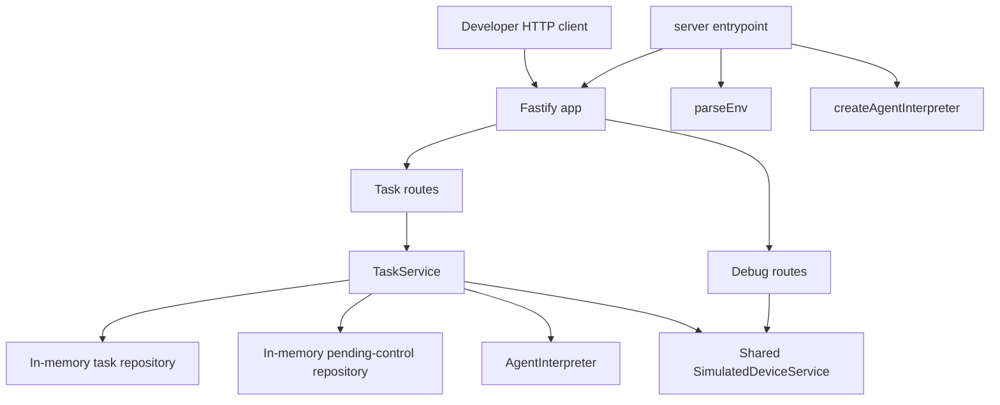
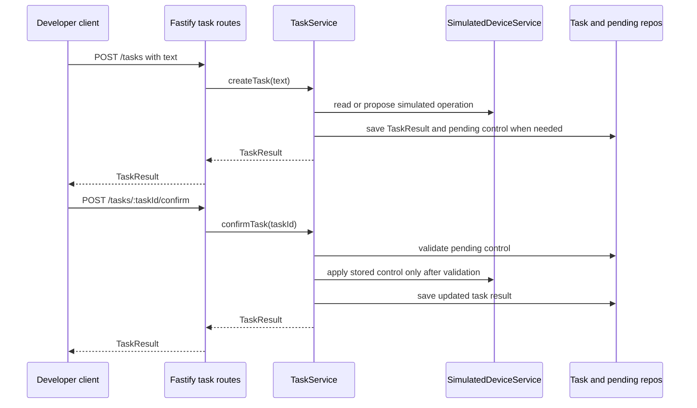
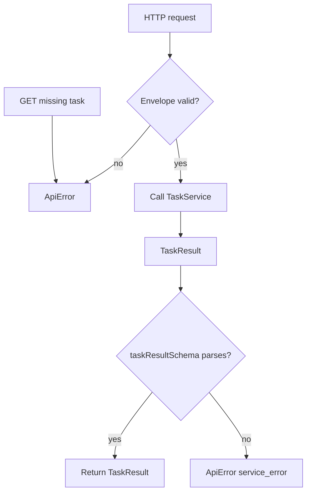

# feat: Detail Fastify Task API

## Summary

Build the Fastify API slice for the Agent Plan Contract service. This plan details only the parent plan's `U5. Fastify Task API`: app construction, task submission and inspection routes, confirmation and rejection routes, a read-only simulated-device debug snapshot, server startup wiring, HTTP integration tests, and developer-facing API documentation.

---

## Problem Frame

The repository now has the lower layers planned by parent U1-U4: provider-neutral contracts, simulated device domain code, task lifecycle and confirmation services, fake interpretation, and LangChain DeepSeek adapter wiring. The remaining U5 work is to expose those service-owned semantics over HTTP without moving task validation, confirmation safety, or simulated mutation into Fastify handlers.

The first consumer remains the developer tester from the origin document. The API must be easy to exercise through curl, Postman, scripts, or Fastify in-process injection while preserving the normalized `TaskResult` contract that future clients can render.

---

## Requirements

**Task HTTP Surface**

- R1. The API accepts a non-empty text task request and returns a schema-valid `TaskResult` for status, control, ambiguous, unsupported, unavailable, and parse-failure outcomes. Origin: R1-R8, R17-R19, R24-R28, F1, F2, F5.
- R2. The API exposes task inspection by stable `taskId` so a developer can retrieve the same task after creation, confirmation, or rejection. Origin: R3, R19.
- R3. The API exposes confirmation and rejection for pending control tasks and delegates mutation safety to `TaskService`. Origin: R9-R13, R16-R19, R23, F3, F4.

**Debug Simulation Surface**

- R4. The API exposes a read-only debug snapshot of the simulated devices used by the same task service instance. Origin: R14-R16 and parent U5.
- R5. The debug snapshot remains a developer V1 support surface and does not become a real IoT adapter contract. Origin: R20, Scope Boundaries.

**Contract And Error Behavior**

- R6. Successful task-route responses parse through `taskResultSchema`; Fastify must not serialize provider-specific LangChain or DeepSeek fields into public responses. Origin: R24-R27.
- R7. Request validation, unknown inspection targets, unknown routes, and unexpected route errors return a stable API error envelope that is distinct from domain-level `TaskResult` outcomes.
- R8. Route handlers use Zod schemas as the canonical contract source and avoid hand-maintaining a second full `TaskResult` schema in Fastify JSON Schema form. Parent KTD5.

**Runtime And Developer Validation**

- R9. App construction is side-effect-free and dependency-injectable so integration tests use fake interpretation, deterministic clocks, deterministic IDs, and in-memory state without binding a port.
- R10. Server startup parses runtime config, builds one shared simulated-device service, chooses fake or DeepSeek interpreter mode through the existing factory, and listens on configured host and port.
- R11. HTTP integration tests cover the origin acceptance examples and the API-specific transport failures: malformed body, unknown task inspection, unknown route, and method mismatch.
- R12. README and contract docs describe the HTTP route surface, fake-mode local usage, confirmation flow, debug snapshot, and optional live DeepSeek mode without requiring credentials for normal tests.

---

## Key Technical Decisions

- KTD1. Separate `buildApp` from `server`: `src/app.ts` returns a configured Fastify instance for tests and callers; `src/server.ts` is the only module that parses process env and calls `listen`. This follows Fastify's documented testing pattern and prevents port binding on import.
- KTD2. Keep the V1 route surface task-centered: expose `POST /tasks`, `GET /tasks/:taskId`, `POST /tasks/:taskId/confirm`, `POST /tasks/:taskId/reject`, and `GET /debug/simulated-devices`. Pending-control-id aliases are deferred unless implementation proves task-id confirmation is insufficient for developer testing.
- KTD3. Treat Zod as canonical and Fastify JSON Schema as optional envelope validation only: route handlers parse bodies, params, and responses through local Zod schemas, while any Fastify route-level schemas cover only simple body or param envelopes.
- KTD4. Return task-domain outcomes as `TaskResult` and transport failures as `ApiError`: `POST /tasks` creates a task record even when the interpreted outcome is blocked, while malformed requests, unknown `GET /tasks/:taskId`, and unknown routes return the API error envelope.
- KTD5. Share runtime dependencies explicitly: production app construction creates one `SimulatedDeviceService`, passes it into `TaskService`, and passes the same instance to debug routes so snapshots reflect confirmed state changes.
- KTD6. Centralize transport error shaping: app-level error and not-found handlers normalize validation errors and unexpected route exceptions without changing `TaskService`'s domain failure mapping.
- KTD7. Defer production API concerns: authentication, authorization, CORS, rate limiting, persistent storage, metrics, and real IoT adapter endpoints stay out of this V1 developer API slice.

---

## High-Level Technical Design



Fastify owns HTTP concerns only: request parsing, route dispatch, transport errors, and serialization. `TaskService` remains the authority for task classification, pending-control lifecycle, mutation timing, and timeline attribution.





The route layer should not reclassify domain outcomes. A blocked device, ambiguous task, unsupported request, rejected control, or missing pending control that `TaskService` represents as a `TaskResult` remains task-shaped over HTTP.

---

## Output Structure

```text
src/
├── app.ts
├── server.ts
├── contracts/
│   └── api-contract.ts
└── routes/
    ├── tasks.ts
    └── simulated-devices.ts
tests/
└── integration/
    ├── api-test-helpers.ts
    ├── tasks-api.test.ts
    ├── tasks-confirmation-api.test.ts
    ├── simulated-devices-api.test.ts
    └── agent-plan-contract-api.e2e.test.ts
```

The exact helper filenames can shift during implementation, but the boundary should stay intact: app construction, route modules, API contract schemas, integration helpers, and HTTP regression tests remain separate.

---

## Implementation Units

### U1. API Contracts And App Factory

- **Goal:** Define the HTTP request, param, and error contracts, then create a side-effect-free Fastify app factory with dependency injection.
- **Requirements:** R6, R7, R8, R9; origin R24-R27 and parent KTD5.
- **Dependencies:** Parent U1-U4.
- **Files:** `src/contracts/api-contract.ts`, `src/app.ts`, `tests/integration/api-test-helpers.ts`, `tests/integration/app-construction.test.ts`.
- **Approach:** Add Zod schemas for task creation body, task id params, and `ApiError`. `buildApp` should accept either a ready `TaskService` plus shared `SimulatedDeviceService`, or factory options that create them from injected dependencies. Register route plugins and app-level error/not-found handlers in one app scope.
- **Patterns to follow:** `src/contracts/task-contract.ts` for strict Zod contract style; Fastify's documented `app`/`server` split; deterministic clock and ID helpers in `tests/fixtures/task-fixtures.ts`.
- **Test scenarios:**
  - Building the app does not call `listen`, parse `process.env`, or require `DEEPSEEK_API_KEY`.
  - App tests can inject a fixed `TaskService`, shared `SimulatedDeviceService`, deterministic clock, and deterministic ID generators.
  - Empty text, missing body, non-object body, and wrong param type fail through the `ApiError` envelope.
  - Unknown routes return the `ApiError` envelope without a Fastify default HTML or provider-specific payload.
  - A route handler response that fails `taskResultSchema` is converted into an internal `ApiError` instead of leaking invalid public shape.
- **Verification:** A test can construct the Fastify app in process, inject a request, and close it without opening a network port.

### U2. Task Creation And Inspection Routes

- **Goal:** Expose task submission and stored task inspection over HTTP.
- **Requirements:** R1, R2, R6, R8, R9, R11; origin R1-R8, R17-R19, R24-R28, F1, F2, F5, AE1, AE4, AE5.
- **Dependencies:** U1.
- **Files:** `src/routes/tasks.ts`, `src/app.ts`, `tests/integration/tasks-api.test.ts`, `tests/integration/api-test-helpers.ts`.
- **Approach:** Implement `POST /tasks` as a thin adapter over `TaskService.createTask(text)` and `GET /tasks/:taskId` as a repository inspection route. Creation returns task-shaped outcomes for completed, pending, ambiguous, unavailable, unsupported, and parse-failure tasks. Inspection returns the stored `TaskResult` or an `ApiError` when no task exists.
- **Patterns to follow:** `TaskService.createTask` and `TaskService.getTask` in `src/domain/tasks/task-service.ts`; `taskResultSchema` response validation from `tests/contracts/task-contract.test.ts`.
- **Test scenarios:**
  - Covers F1 / AE1. Creating an air-conditioner status task returns a schema-valid completed `TaskResult` with selected device/data items and timeline attribution.
  - Retrieving the created task by `taskId` returns the same persisted task result.
  - Covers F2 / AE5. Creating an ambiguous bedroom-device task returns `needs_clarification`, candidate context, and no control mutation.
  - Covers F5 / AE4. Creating an offline kitchen-light control task returns `unavailable`, no `pendingControl`, and no simulated execution timeline event.
  - Unsupported or parse-failure utterances return schema-valid non-success task results without LangChain or DeepSeek provider fields.
  - Malformed create-task bodies return `ApiError` and do not create task records.
  - Inspecting an unknown task returns `ApiError` and does not synthesize a fake stored task.
- **Verification:** Developer clients can submit and inspect every non-confirmation task outcome through HTTP with the same public task contract used by domain tests.

### U3. Confirmation And Rejection Routes

- **Goal:** Expose pending-control confirmation and rejection through task-centered HTTP routes.
- **Requirements:** R2, R3, R6, R8, R9, R11; origin R9-R13, R16-R19, R23, F3, F4, AE2, AE3.
- **Dependencies:** U1, U2.
- **Files:** `src/routes/tasks.ts`, `tests/integration/tasks-confirmation-api.test.ts`, `tests/integration/api-test-helpers.ts`.
- **Approach:** Implement `POST /tasks/:taskId/confirm` and `POST /tasks/:taskId/reject` as direct calls to `TaskService.confirmTask(taskId)` and `TaskService.rejectTask(taskId)`. Do not reinterpret original text during confirmation. The route returns the service-produced `TaskResult` so duplicate, expired, missing, and rejected pending-control outcomes stay contract-shaped when the service can represent them.
- **Patterns to follow:** Confirmation lifecycle in `tests/domain/tasks/task-service-confirmation.test.ts`; pending-control invariants in `src/domain/tasks/pending-control-repository.ts`.
- **Test scenarios:**
  - Covers F3 / AE3. Creating a hallway-light control task returns `pending_confirmation`, creates `pendingControl`, and leaves the debug-readable state unchanged before confirmation.
  - Covers F4 / AE2. Confirming the pending task returns a completed `TaskResult`, removes `pendingControl`, records confirmation and simulated execution timeline stages, and persists the updated task.
  - Covers AE3. Rejecting a pending task returns `rejected`, records rejection timeline evidence, persists the rejected task, and leaves simulated state unchanged.
  - Confirming an already confirmed task returns a schema-valid blocked outcome without applying mutation twice.
  - Confirming an already rejected or expired pending task returns a schema-valid blocked outcome without mutation.
  - Confirming or rejecting a task id with no pending control returns the service-owned failed task outcome when available, and does not create a stored task for a missing id.
  - Confirmation and rejection routes never call the interpreter and never accept a new natural-language body.
- **Verification:** The HTTP confirmation flow proves that pending controls mutate simulated state only through stored service validation.

### U4. Simulated Device Debug Snapshot Route

- **Goal:** Expose a read-only developer snapshot of simulated devices that reflects the same in-process state used by task routes.
- **Requirements:** R4, R5, R6, R9, R11; origin R14-R16, R20, AE2, AE3.
- **Dependencies:** U1, U2, U3.
- **Files:** `src/routes/simulated-devices.ts`, `src/app.ts`, `tests/integration/simulated-devices-api.test.ts`.
- **Approach:** Implement `GET /debug/simulated-devices` as a read-only route over the shared `SimulatedDeviceService.debugSnapshot()`. The response should parse through existing simulated-device schemas and avoid adding write, reset, seed-editing, or real-adapter operations.
- **Patterns to follow:** `SimulatedDeviceService.debugSnapshot` and snapshot tests in `tests/domain/devices/simulated-device-service.test.ts`.
- **Test scenarios:**
  - Debug snapshot returns light, air-conditioner, and environmental sensor contexts that parse through `simulatedDeviceContextSchema`.
  - Snapshot reflects a confirmed hallway-light control after the confirmation route completes.
  - Snapshot remains unchanged after a rejected or unconfirmed pending control.
  - Snapshot route is read-only; unsupported methods return `ApiError` or Fastify method handling normalized by the app.
  - Offline device availability and unavailable reason are visible without exposing real IoT provider fields.
- **Verification:** Developers can inspect simulated state transitions through HTTP without adding mutation endpoints outside the confirmation flow.

### U5. Server Runtime Wiring

- **Goal:** Add the executable server entrypoint that wires configuration, interpreter selection, shared services, Fastify app creation, and network listening.
- **Requirements:** R9, R10, R12; origin Dependencies And Assumptions and parent U5.
- **Dependencies:** U1-U4 and parent U4.
- **Files:** `src/server.ts`, `src/app.ts`, `package.json`, `README.md`, `tests/integration/server-wiring.test.ts`.
- **Approach:** Keep runtime construction small: parse env with `parseEnv`, create one `SimulatedDeviceService`, create `AgentInterpreter` through `createAgentInterpreter`, build `TaskService`, pass both services into `buildApp`, and listen with configured host and port. Fake mode must remain the default local path; DeepSeek mode must continue to fail fast without `DEEPSEEK_API_KEY`.
- **Patterns to follow:** `src/config/env.ts`; `src/agent/agent-factory.ts`; Fastify `listen` docs for host and port options.
- **Test scenarios:**
  - Importing `src/app.ts` and route modules has no server-listening side effect.
  - Runtime dependency construction in fake mode does not require `DEEPSEEK_API_KEY`.
  - DeepSeek mode uses the parsed model and API key through `createAgentInterpreter` rather than reading env inside routes.
  - Server listen failures are logged or surfaced without swallowing the error.
  - Package scripts or documented startup paths point at the actual emitted server entry after TypeScript compilation.
- **Verification:** A developer can start the service in fake mode from documented setup and reach the HTTP API without live model credentials.

### U6. HTTP Acceptance Regression And Documentation

- **Goal:** Add end-to-end HTTP regression coverage and docs for the developer-facing API.
- **Requirements:** R1-R12; origin AE1-AE5 and Success Criteria.
- **Dependencies:** U1-U5.
- **Files:** `tests/integration/agent-plan-contract-api.e2e.test.ts`, `tests/fixtures/sample-utterances.ts`, `docs/contracts/agent-plan-contract.md`, `README.md`.
- **Approach:** Encode the origin acceptance examples at HTTP level using fake interpreter mode and Fastify injection. Update docs with route examples, request bodies, response semantics, confirmation flow, debug snapshot, fake-mode defaults, and optional live DeepSeek configuration. Keep docs clear that the debug endpoint and in-memory state are V1 developer supports.
- **Patterns to follow:** Existing sample utterance fixture in `tests/fixtures/sample-utterances.ts`; current README style; `docs/contracts/agent-plan-contract.md` provider-boundary and pending-control sections.
- **Test scenarios:**
  - Covers AE1. HTTP status query returns air-conditioner values, selected data items, and timeline evidence.
  - Covers AE2. HTTP control request, confirmation, and follow-up status or debug snapshot show the confirmed light state change.
  - Covers AE3. HTTP control request without confirmation leaves follow-up status or debug snapshot unchanged.
  - Covers AE4. HTTP offline control returns unavailable and does not create an executable pending control.
  - Covers AE5. HTTP ambiguous bedroom request asks for clarification and returns candidates.
  - Every task-shaped HTTP response parses through `taskResultSchema`; every debug device parses through `simulatedDeviceContextSchema`; every transport failure parses through `ApiError`.
  - Documentation examples use fake mode and do not require a real DeepSeek key.
- **Verification:** A developer can follow the README, exercise the core API flow in fake mode, and understand which fields future clients should render.

---

## Acceptance Examples

- AE1. Status over HTTP: `POST /tasks` with an air-conditioner status request returns a completed task result with selected simulated device/data items and timeline evidence.
- AE2. Confirmed control over HTTP: `POST /tasks` creates a pending hallway-light control, `POST /tasks/:taskId/confirm` mutates simulated state, and later inspection shows the completed outcome.
- AE3. Rejected or unconfirmed control over HTTP: a pending hallway-light control left pending or rejected does not change simulated state.
- AE4. Offline control over HTTP: an offline kitchen-light control request returns unavailable and creates no executable pending control.
- AE5. Ambiguous request over HTTP: a vague bedroom-device request returns clarification with candidate context and no mutation.
- AE6. Transport failures are stable: malformed task bodies, unknown task inspection, and unknown routes return `ApiError` instead of Fastify default error shapes.

---

## Scope Boundaries

### In Scope

- Fastify app factory, route modules, request/param/error schemas, task creation and inspection endpoints, confirmation and rejection endpoints, read-only debug simulated-device endpoint, server entrypoint, HTTP integration tests, and API documentation.

### Deferred To Follow-Up Work

- Pending-control-id alias routes, task listing, task deletion, debug state reset, seed editing, OpenAPI generation, generated JSON Schema from Zod, health/readiness endpoints, and production observability.
- Authentication, authorization, CORS, rate limiting, persistent storage, multi-process state, and deployment-specific server hardening.
- Real IoT adapter endpoints, real device mutation, real household permission models, and audit-retention policy.
- End-user frontend, WeChat mini program integration, voice surfaces, streaming responses, and LangGraph orchestration.

---

## System-Wide Impact

This slice turns the Agent Plan Contract from an internal service contract into the first public developer API. The main system rule is unchanged: future clients should depend on task semantics and timelines, not on Fastify implementation details, LangChain internals, or the debug snapshot's in-memory simulation shape.

---

## Risks And Dependencies

- **Contract drift:** Route responses can drift from Zod contracts if Fastify serialization is allowed to reshape the payload. Mitigation: parse every task-shaped response through `taskResultSchema` in integration tests and keep full response schemas out of hand-written Fastify JSON Schema.
- **State split:** Debug snapshots can show different state than task routes if app construction creates multiple device services. Mitigation: share one `SimulatedDeviceService` across `TaskService` and debug routes.
- **HTTP/domain confusion:** Domain failures such as ambiguous target or offline device can be incorrectly treated as transport errors. Mitigation: reserve `ApiError` for request, route, and unexpected handler failures; return service-owned `TaskResult` for domain outcomes.
- **Confirmation replay:** Duplicate confirmation can mutate twice if routes bypass repository lifecycle validation. Mitigation: routes must call `TaskService.confirmTask` or `rejectTask` only.
- **Fastify schema mismatch:** Fastify v5 route schemas are JSON Schema, while this repo's canonical contracts are Zod. Mitigation: validate simple envelopes at the route layer and keep public task-result validation in Zod until a deliberate generation bridge exists.
- **Live model startup:** DeepSeek mode can fail at startup without credentials. Mitigation: fake mode remains default and server startup uses existing `parseEnv` guard.

---

## Documentation And Operational Notes

- `README.md` should document fake-mode startup, HTTP route examples, confirmation flow, debug snapshot, and optional DeepSeek env variables.
- `docs/contracts/agent-plan-contract.md` should add an HTTP API section that describes `TaskResult` versus `ApiError`, without turning debug snapshot into a real-device API promise.
- In-memory task, pending-control, and simulated-device state reset on process restart; document this as V1 behavior.
- Normal tests should use Fastify injection and fake interpreter mode; no live DeepSeek calls belong to the HTTP integration suite.

---

## Sources And Research

- Origin requirements: `docs/brainstorms/2026-06-06-agent-plan-contract-requirements.md`.
- Parent plan: `docs/plans/2026-06-07-001-feat-agent-plan-contract-service-plan.md`.
- Prior child plans: `docs/plans/2026-06-07-002-feat-project-scaffold-contracts-plan.md`, `docs/plans/2026-06-07-003-feat-simulated-device-domain-plan.md`, `docs/plans/2026-06-07-004-feat-task-lifecycle-confirmation-service-plan.md`, `docs/plans/2026-06-07-005-feat-langchain-deepseek-interpreter-adapter-plan.md`.
- Current contracts and services: `src/contracts/task-contract.ts`, `src/contracts/device-contract.ts`, `src/domain/tasks/task-service.ts`, `src/domain/tasks/task-repository.ts`, `src/domain/tasks/pending-control-repository.ts`, `src/domain/devices/simulated-device-service.ts`, `src/agent/agent-factory.ts`, `src/config/env.ts`.
- Existing tests and fixtures: `tests/contracts/task-contract.test.ts`, `tests/domain/tasks/task-service-outcomes.test.ts`, `tests/domain/tasks/task-service-confirmation.test.ts`, `tests/domain/devices/simulated-device-service.test.ts`, `tests/fixtures/task-fixtures.ts`, `tests/fixtures/sample-utterances.ts`.
- Local package pins: `package.json` uses `fastify@5.8.5`, `zod@4.4.3`, `vitest@4.1.8`, TypeScript ESM, and Node 20.
- Fastify local docs from installed `fastify@5.8.5`: `node_modules/.pnpm/fastify@5.8.5/node_modules/fastify/docs/Guides/Testing.md`, `node_modules/.pnpm/fastify@5.8.5/node_modules/fastify/docs/Reference/Routes.md`, `node_modules/.pnpm/fastify@5.8.5/node_modules/fastify/docs/Reference/Validation-and-Serialization.md`, `node_modules/.pnpm/fastify@5.8.5/node_modules/fastify/docs/Reference/Server.md`.
- Fastify official docs: https://fastify.dev/docs/latest/Guides/Testing/, https://fastify.dev/docs/latest/Reference/Routes/, https://fastify.dev/docs/latest/Reference/Validation-and-Serialization/, https://fastify.dev/docs/latest/Reference/Server/.
- Context7 library-doc lookup was unavailable because `CONTEXT7_API_KEY` is not configured; local installed Fastify docs were used for version-specific guidance.
