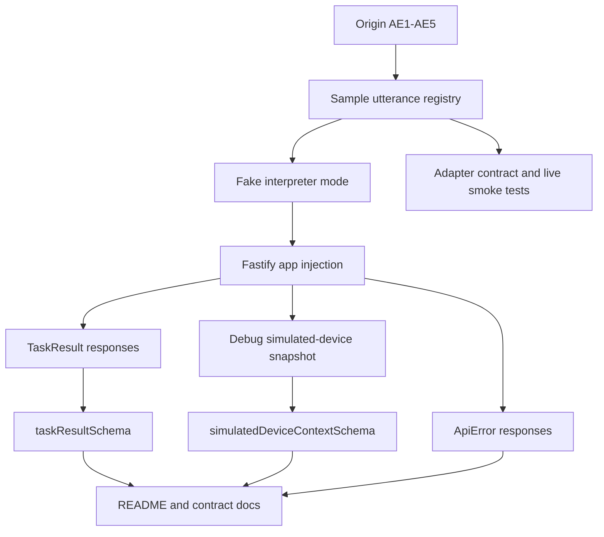
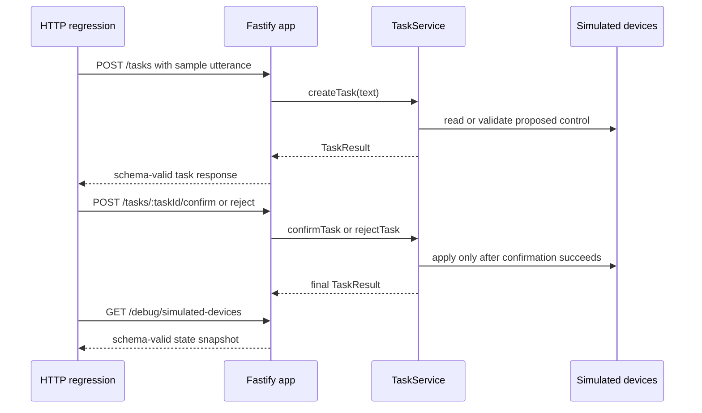

# feat: Detail regression suite and developer documentation

## Summary

Build the closing regression and documentation slice for the Agent Plan Contract service. This plan details only the parent plan's `U6. Regression Suite And Developer Documentation`: reusable sample utterance coverage, HTTP-level acceptance regression for the origin examples, schema and provider-boundary drift checks, fake-mode quickstart docs, contract reference docs, and opt-in live DeepSeek smoke documentation.

---

## Problem Frame

The parent plan established a text-first simulated IoT Agent backend and split the implementation into contracts, simulated devices, task lifecycle, interpreter adapter, and Fastify API units. U6 is the integration safety net and developer handoff layer: it proves the slices work together through the same HTTP contract a developer tester will use, then documents how to run, inspect, and extend the service without live model credentials.

The origin requirements make developer verification the first review surface. The regression suite should therefore exercise the public API and task contract, not only lower-level domain functions, while keeping live DeepSeek validation optional and outside the normal offline suite.

---

## Requirements

**Regression Coverage**

- R1. The HTTP acceptance suite covers the origin examples for air-conditioner status, confirmed light control, unconfirmed or rejected control, offline control, and ambiguous device references. Origin: AE1-AE5, F1-F5.
- R2. Sample utterances remain the shared fixture source for fake interpreter, adapter, domain, and HTTP regression tests so scenario wording and expected proposal kinds do not drift. Origin: R28 and parent U4/U6.
- R3. Every task-shaped regression response parses through `taskResultSchema`, every debug simulated-device response parses through `simulatedDeviceContextSchema`, and every transport failure covered by this slice parses through `apiErrorSchema`. Origin: R1-R4, R17-R19, R24-R27.
- R4. Regression tests preserve the no-mutation boundary: control requests do not change simulated state until confirmation succeeds, and offline, ambiguous, unsupported, rejected, or unconfirmed paths do not apply controls. Origin: R9-R16, R23.

**Developer Documentation**

- R5. `README.md` explains local fake-mode setup, route usage, confirmation flow, debug snapshot behavior, test posture, and optional live DeepSeek smoke validation without requiring credentials for default development. Origin: Success Criteria and Dependencies And Assumptions.
- R6. `docs/contracts/agent-plan-contract.md` documents the normalized task result, lifecycle states, timeline vocabulary, pending controls, simulated-device context, provider boundary, environment modes, and V1 boundaries. Origin: R1-R28.
- R7. Documentation keeps quickstart examples developer-facing and inspectable while avoiding promises about real IoT adapters, production persistence, auth, rate limiting, voice, or frontend behavior. Origin: Scope Boundaries and parent Scope Boundaries.
- R8. Known V1 operational limits that remain outside U6, including in-memory task growth and runtime timeout hardening, are surfaced as deferred follow-up work rather than silently documented as production-ready behavior. Source: `docs/residual-review-findings/feat-fastify-task-api-http.md`.

---

## Key Technical Decisions

- KTD1. Put acceptance proof at the HTTP layer: the final U6 regression suite should drive `buildApp` with Fastify injection and fake interpretation because the developer-facing contract is the route response, not a domain-only object.
- KTD2. Treat `tests/fixtures/sample-utterances.ts` as the scenario registry: each origin acceptance example gets a stable fixture id, text, expected proposal kind, and target hint so adapter and API tests share language.
- KTD3. Use schemas as the primary drift oracle: `taskResultSchema`, `simulatedDeviceContextSchema`, and `apiErrorSchema` catch accidental response, debug snapshot, and transport envelope drift without duplicating a second assertion model.
- KTD4. Keep live DeepSeek checks opt-in and coarse: the live smoke suite should require both `DEEPSEEK_LIVE_SMOKE` and `DEEPSEEK_API_KEY`, assert valid proposal categories, and stay out of default offline regression.
- KTD5. Split documentation by reader task: `README.md` owns quickstart and operational usage; `docs/contracts/agent-plan-contract.md` owns stable contract semantics and provider boundaries.
- KTD6. Document V1 as simulated and in-memory: U6 may improve discoverability of the debug endpoint and state reset behavior, but it must not add production adapter, persistence, auth, rate-limit, or monitoring commitments.

---

## High-Level Technical Design

The regression suite proves the same examples that documentation describes. The docs should not introduce sample flows that are not covered by fake-mode fixtures or HTTP-level acceptance tests.

---

## Scope Boundaries

### In Scope

- Fake-mode HTTP acceptance regression for the origin acceptance examples.
- Shared sample utterance fixture coverage for status, control, unconfirmed control, offline control, ambiguity, unsupported or read-only behavior, and parse failure.
- Schema-based regression checks for task responses, debug device snapshots, API errors, and provider-boundary leakage.
- README and contract documentation for local setup, route usage, confirmation, debug inspection, fake mode, optional live DeepSeek smoke, and V1 limitations.

### Deferred To Follow-Up Work

- Real IoT adapter documentation, production mutation runbooks, and device-provider operational playbooks.
- Persistent storage, task retention policy, and bounded in-memory task repositories.
- Runtime request or handler timeout hardening.
- Authentication, authorization, CORS, rate limiting, production observability, and deployment guides.
- CI wiring for live DeepSeek smoke checks; live model validation remains a manual opt-in path.
- End-user frontend, WeChat mini program, voice, ASR, TTS, wake word, and polished conversational copy docs.

---

## Implementation Units

### U1. Acceptance Fixture Registry

- **Goal:** Strengthen the sample utterance registry so U6 has a single source for acceptance example text and expected interpreter behavior.
- **Requirements:** R1, R2, R4; origin AE1-AE5, R28.
- **Dependencies:** Parent U1-U5.
- **Files:** `tests/fixtures/sample-utterances.ts`, `tests/fixtures/task-fixtures.ts`, `tests/agent/fake-interpreter.test.ts`, `tests/agent/langchain-adapter-contract.test.ts`.
- **Approach:** Keep stable ids for the five origin acceptance examples and preserve additional negative cases for read-only or unsupported control and parse failure. Ensure fixture entries carry enough metadata for tests to assert proposal kind and target intent without re-encoding natural-language strings in multiple files.
- **Patterns to follow:** Existing fixture ids such as `ae1-living-room-ac-status`; proposal fixtures in `tests/fixtures/task-fixtures.ts`; fake interpreter coverage in `tests/agent/fake-interpreter.test.ts`.
- **Test scenarios:**
  - Covers AE1. The air-conditioner status fixture maps to a `status_query` proposal with the living-room air conditioner as the target hint.
  - Covers AE2 and AE3. Hallway-light control fixtures map to `control_request` proposals that request power-on but do not claim execution.
  - Covers AE4. Offline kitchen-light control remains represented as a scenario that service validation can downgrade to unavailable.
  - Covers AE5. Vague bedroom-device text remains represented as an ambiguous scenario with multiple candidate targets.
  - Unsupported or read-only write and nonsensical input fixtures exercise non-happy-path behavior without live model calls.
- **Verification:** Tests and docs can reference sample utterance ids rather than duplicating scenario text or expected proposal shapes.

### U2. HTTP Acceptance Regression Suite

- **Goal:** Cover the origin acceptance examples through the public Fastify API using fake interpreter mode and shared in-memory simulated state.
- **Requirements:** R1, R3, R4; origin F1-F5, AE1-AE5.
- **Dependencies:** U1 and parent U5.
- **Files:** `tests/integration/agent-plan-contract-api.e2e.test.ts`, `tests/integration/api-test-helpers.ts`, `tests/fixtures/sample-utterances.ts`.
- **Approach:** Use Fastify injection against `buildApp` with a deterministic fake interpreter, fixed clock, deterministic ids, and a shared `SimulatedDeviceService`. Assert both task responses and debug snapshots so state transitions are proven at the API boundary.
- **Patterns to follow:** `tests/integration/tasks-api.test.ts` for route-level schema parsing; `tests/integration/tasks-confirmation-api.test.ts` for confirmation lifecycle expectations; `tests/integration/simulated-devices-api.test.ts` for debug snapshot behavior.
- **Test scenarios:**
  - Covers AE1. Creating the air-conditioner status task returns `completed`, selects `power`, `mode`, `target_temperature`, and `room_temperature`, and includes simulated-device timeline evidence.
  - Covers AE2. Creating a hallway-light control task returns `pending_confirmation`; confirming it returns `completed`; a later debug snapshot or status query reports the light as on.
  - Covers AE3. Creating a hallway-light control task and leaving it unconfirmed keeps the debug snapshot or follow-up status unchanged.
  - Covers AE3. Rejecting a pending hallway-light task returns `rejected` and keeps the simulated light state unchanged.
  - Covers AE4. Creating an offline kitchen-light control task returns `unavailable`, uses `device_offline`, omits `pendingControl`, and does not include `simulated_execution`.
  - Covers AE5. Creating a vague bedroom-device task returns `needs_clarification`, uses `ambiguous_target`, and exposes more than one candidate.
  - Each task-shaped response from the suite parses through `taskResultSchema`.
- **Verification:** The API-level suite demonstrates the five origin examples without binding a port or calling DeepSeek.

### U3. Contract Drift And Provider Boundary Guards

- **Goal:** Add regression assertions that prevent public responses and docs examples from drifting toward implementation internals.
- **Requirements:** R3, R4, R6; origin R17-R19, R24-R27.
- **Dependencies:** U1, U2.
- **Files:** `tests/integration/agent-plan-contract-api.e2e.test.ts`, `tests/integration/tasks-api.test.ts`, `tests/integration/simulated-devices-api.test.ts`, `tests/contracts/task-contract.test.ts`, `src/contracts/api-contract.ts`.
- **Approach:** Use schema parsing as the first guard, then add targeted assertions for provider leakage and task-vs-transport failure separation. The suite should check representative successful, pending, ambiguous, unavailable, rejected, parse-failure, malformed-body, unknown-task, unknown-route, and method-mismatch paths where those paths already exist in the API slice.
- **Patterns to follow:** Existing `JSON.stringify(result)` provider-boundary checks in `tests/integration/tasks-api.test.ts`; strict Zod schemas in `src/contracts/task-contract.ts` and `src/contracts/api-contract.ts`.
- **Test scenarios:**
  - Completed, pending, rejected, unavailable, ambiguous, unsupported, and parse-failure task outcomes parse through `taskResultSchema`.
  - Debug snapshot devices parse through `simulatedDeviceContextSchema`.
  - Malformed request bodies and unknown inspection targets parse through `apiErrorSchema` and do not create task records.
  - Public task JSON does not contain required LangChain or DeepSeek fields such as tool-call objects, run ids, provider metadata, or raw model payloads.
  - Pending-control responses never include `simulated_execution` before confirmation.
  - Confirmation or rejection routes do not accept new natural-language command bodies and do not call the interpreter.
- **Verification:** Contract drift fails at test time before docs or future clients start relying on leaked implementation details.

### U4. README Developer Walkthrough

- **Goal:** Make `README.md` sufficient for a developer tester to install, start, exercise, and inspect the V1 service in fake mode.
- **Requirements:** R5, R7, R8; origin Success Criteria and Scope Boundaries.
- **Dependencies:** U1-U3 and parent U5.
- **Files:** `README.md`, `.env.example`, `package.json`, `tests/integration/agent-plan-contract-api.e2e.test.ts`.
- **Approach:** Keep README focused on developer workflow: service purpose, local runtime prerequisites, fake-mode default, route list, task creation example, confirmation and rejection examples, debug snapshot, default offline checks, and optional live smoke. Align example utterances with `tests/fixtures/sample-utterances.ts` so docs demonstrate covered behavior.
- **Patterns to follow:** Current README route overview and curl-style examples; package scripts in `package.json`; environment variables in `.env.example` and `src/config/env.ts`.
- **Test scenarios:**
  - README task examples use utterance text present in `tests/fixtures/sample-utterances.ts`.
  - README explains that fake mode does not require `DEEPSEEK_API_KEY`.
  - README explains that control requests require a follow-up confirmation route before mutation.
  - README describes `GET /debug/simulated-devices` as read-only developer support and not a real IoT adapter API.
  - README mentions that default validation is offline and live DeepSeek smoke requires explicit opt-in plus credentials.
- **Verification:** A developer can follow the README from a fresh checkout, run fake mode, submit status and control examples, inspect task/timeline output, and understand why live DeepSeek is optional.

### U5. Contract Reference Documentation

- **Goal:** Update the contract document so future clients and implementers understand the stable Agent Plan Contract semantics without reading service internals.
- **Requirements:** R6, R7, R8; origin R1-R28.
- **Dependencies:** U1-U3.
- **Files:** `docs/contracts/agent-plan-contract.md`, `src/contracts/task-contract.ts`, `src/contracts/device-contract.ts`, `src/contracts/api-contract.ts`, `tests/fixtures/contract-fixtures.ts`.
- **Approach:** Keep Zod schemas as canonical and use the contract doc as a readable semantic reference. Cover task fields, lifecycle states, outcome reasons, timeline vocabulary, pending controls, simulated device context, provider-neutral boundary, environment modes, and V1 exclusions. Avoid duplicating a full generated schema table unless the implementation introduces one.
- **Patterns to follow:** Current contract doc sections; fixture examples in `tests/fixtures/contract-fixtures.ts`; timeline vocabulary in `src/contracts/task-contract.ts`.
- **Test scenarios:**
  - Contract fixtures still parse through `taskResultSchema` after doc updates.
  - Documentation names the same lifecycle states and timeline stages exported by `src/contracts/task-contract.ts`.
  - Documentation distinguishes `TaskResult` domain outcomes from `ApiError` transport failures.
  - Pending-control docs state that mutation happens only after confirmation and that confirmation routes operate on stored task ids.
  - Provider-boundary docs state that clients do not depend on LangChain messages, tool calls, run objects, DeepSeek payloads, or model metadata.
- **Verification:** A future client implementer can read the contract doc and know which fields are public semantics, which are debug context, and which V1 behaviors are intentionally out of scope.

### U6. Optional Live DeepSeek Smoke Handoff

- **Goal:** Keep live model validation discoverable while preserving deterministic offline regression as the default.
- **Requirements:** R5, R6, R7; origin R28 and Dependencies And Assumptions.
- **Dependencies:** U1, U3 and parent U4.
- **Files:** `tests/agent/langchain-live-smoke.test.ts`, `src/agent/live-smoke.ts`, `README.md`, `docs/contracts/agent-plan-contract.md`.
- **Approach:** Document the live smoke gate and keep assertions coarse: status text should return a valid `status_query` proposal, control text should return a valid `control_request` proposal, and both should parse through `agentProposalSchema`. The smoke path should not replace fake-mode acceptance regression or require credentials in normal development.
- **Patterns to follow:** `shouldRunDeepSeekLiveSmoke` in `src/agent/live-smoke.ts`; live smoke test skip pattern in `tests/agent/langchain-live-smoke.test.ts`; interpreter mode docs in README.
- **Test scenarios:**
  - Live smoke gate returns false with no environment, only opt-in, or only API key.
  - Live smoke gate returns true only when both explicit opt-in and `DEEPSEEK_API_KEY` are present.
  - When enabled, the live smoke test requests one status proposal and one control proposal and validates both through `agentProposalSchema`.
  - Live smoke docs warn that network access, model availability, and cost are outside the default regression suite.
- **Verification:** Developers can intentionally run live DeepSeek validation when credentials are available, while CI and local defaults remain deterministic and offline.

---

## Acceptance Examples

- AE1. Air-conditioner status regression: the HTTP suite submits the shared air-conditioner status utterance and receives a completed task with selected values and timeline evidence.
- AE2. Confirmed light control regression: the HTTP suite submits the hallway-light control utterance, confirms the task, and observes the simulated light state change.
- AE3. Unconfirmed or rejected control regression: the HTTP suite leaves a hallway-light control pending or rejects it and observes no simulated state change.
- AE4. Offline control regression: the HTTP suite submits the offline kitchen-light control utterance and receives an unavailable task with no executable pending control.
- AE5. Ambiguous device regression: the HTTP suite submits the vague bedroom-device utterance and receives clarification with candidate context.

---

## Documentation And Operational Notes

- `README.md` should stay concise and operational: what the service is, how fake mode works, which routes exist, how to confirm or reject controls, how to inspect simulated state, and when live DeepSeek smoke is appropriate.
- `docs/contracts/agent-plan-contract.md` should stay semantic and contract-oriented: it describes public fields and lifecycle meanings, not implementation call graphs.
- `.env.example` should remain aligned with `src/config/env.ts`, especially `AGENT_INTERPRETER_MODE`, `DEEPSEEK_API_KEY`, `DEEPSEEK_MODEL`, host, port, and debug-snapshot exposure.
- U6 should not add production deployment, monitoring, real-device runbook, or live-model CI documentation beyond calling those out as deferred.

---

## System-Wide Impact

This slice becomes the regression and documentation baseline for later mini program, voice, real IoT adapter, and persistence work. Future changes to task semantics, timeline stages, simulated device context, or interpreter behavior should either extend the sample utterance registry and HTTP acceptance suite or consciously update the contract docs at the same time.

---

## Risks And Dependencies

- **Docs drifting from behavior:** README and contract examples may fall behind tests. Mitigation: reuse sample utterance text in docs and keep examples tied to covered fake-mode flows.
- **Regression suite becoming too broad:** U6 can accidentally retest every lower-layer unit. Mitigation: keep U6 focused on cross-layer contract behavior and leave detailed domain edge cases in domain tests.
- **Live smoke flakiness:** DeepSeek availability, credentials, cost, and model behavior are external. Mitigation: keep live smoke skipped by default and validate only coarse proposal contract behavior.
- **False production confidence:** Developer docs could make in-memory state, debug endpoints, and no-auth routes look production-ready. Mitigation: document V1 boundaries and defer production hardening explicitly.
- **Residual operational gaps:** Request/handler timeout hardening and bounded task storage remain open follow-ups. Mitigation: reference them as deferred limitations rather than expanding U6 into runtime hardening.

---

## Sources And Research

- Origin requirements: `docs/brainstorms/2026-06-06-agent-plan-contract-requirements.md`.
- Parent plan: `docs/plans/2026-06-07-001-feat-agent-plan-contract-service-plan.md`.
- Related API slice plan: `docs/plans/2026-06-07-006-feat-fastify-task-api-plan.md`.
- Residual API review notes: `docs/residual-review-findings/feat-fastify-task-api-http.md`.
- Current sample utterances: `tests/fixtures/sample-utterances.ts`.
- Current HTTP acceptance suite: `tests/integration/agent-plan-contract-api.e2e.test.ts`.
- Current contract reference: `docs/contracts/agent-plan-contract.md`.
- Current developer quickstart: `README.md`.
- No new external research was needed for this U6 detail plan because the work is constrained by the origin requirements, parent plans, and existing local Fastify/Vitest/Zod test patterns.
