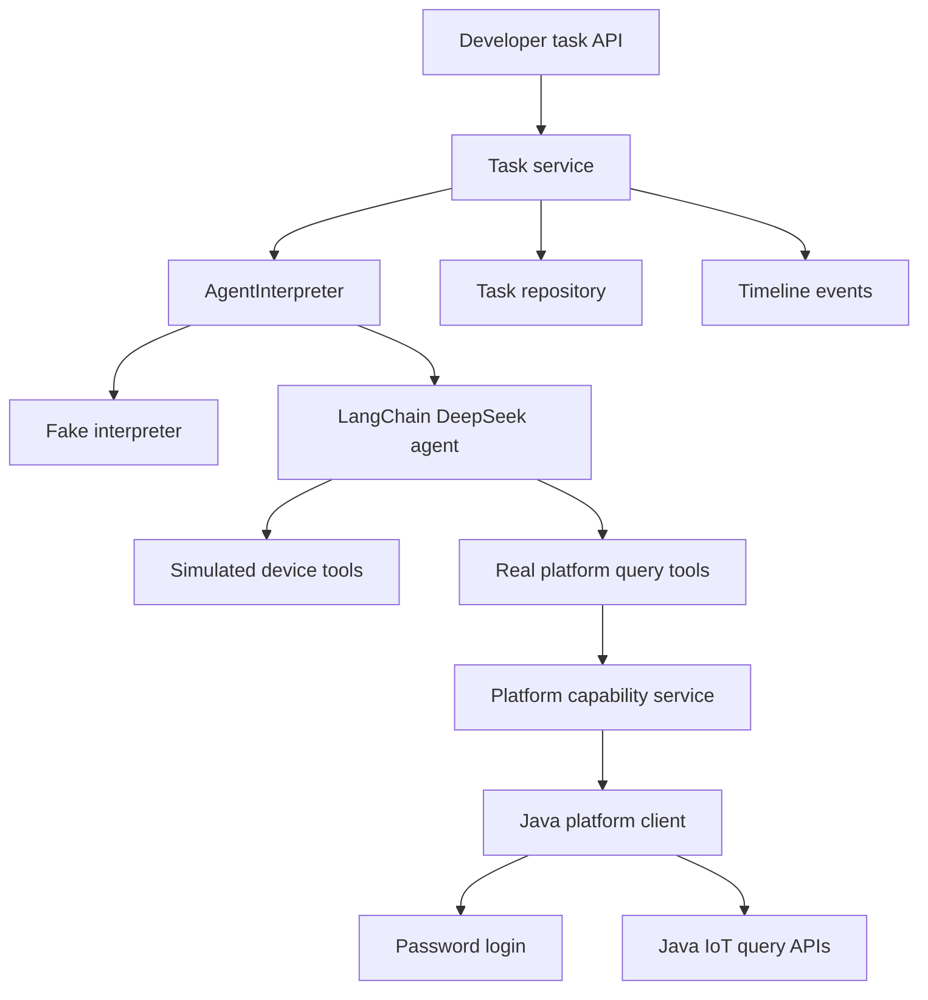
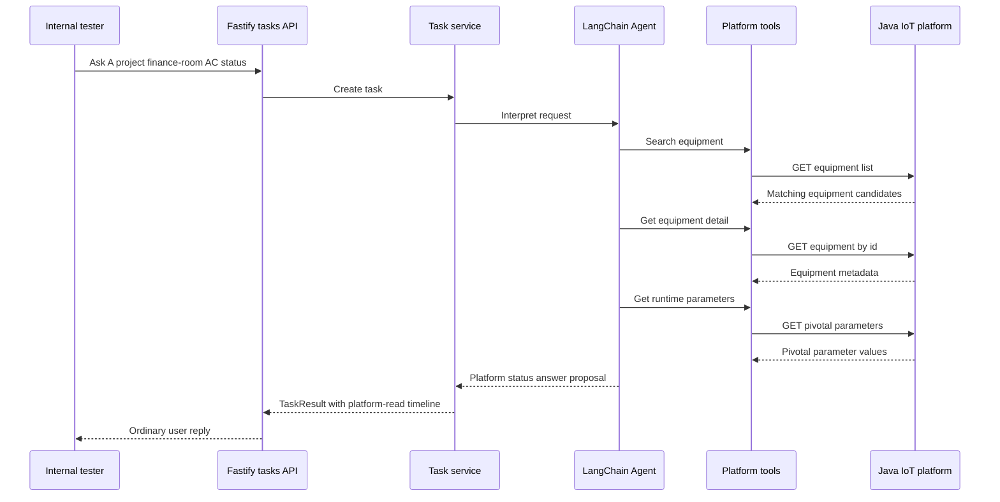
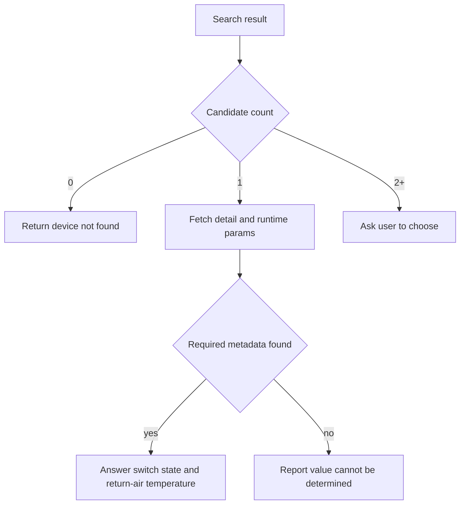

# feat: Add Device Capability Registry real-platform query mode

## Summary

Add an internal real-platform query mode that lets the Agent use governed tools over the existing Java IoT APIs to answer the target air-conditioner status question. The plan keeps simulated mode intact, adds a Java platform client and platform tools, and extends task results just enough to represent read-only platform status outcomes.

---

## Problem Frame

The current service proves the Agent Plan Contract against in-memory simulated devices. The next useful slice is not a production IoT adapter or device-control workflow; it is a developer-verifiable bridge to the existing Java platform so the Agent can actively call real query interfaces.

The immediate validation path is the user asking whether the air conditioner in A project, first-floor finance room is on and what the current temperature is. The backend facts now available are a password login flow, a fixed validation `projectId` of `270544150790145`, and OpenAPI definitions for project or area listing, simple equipment listing, equipment detail, and single-equipment pivotal runtime parameters.

For this fast validation slice, real-platform mode uses a configured validation login instead of forwarding each API caller's platform session. Per-user platform auth forwarding remains a later production-hardening step.

---

## Requirements

**Configuration And Safety**

- R1. The service can run the existing fake and simulated modes without platform credentials or backend network calls.
- R2. Real-platform query mode is enabled only by explicit local configuration and must not commit the validation account password to source control.
- R3. The validation project defaults to `270544150790145` unless overridden by local configuration.
- R4. Platform request failures, login failures, no-data responses, and unrecognized runtime metadata produce task-shaped non-success outcomes.

**Java Platform Query Capabilities**

- R5. The platform client authenticates through the existing password-login interface using configured validation credentials before calling device-query APIs.
- R6. The client wraps the Java APIs from `58.json`: project or area listing, simple equipment listing, equipment detail, and pivotal runtime parameters.
- R7. Platform tool results preserve the backend's original fields for the LLM in internal mode while keeping public task results provider-neutral.
- R8. Platform calls use bounded timeouts and sanitized error reporting so backend failures do not leak secrets or raw request details.

**Agent Tool Use**

- R9. In real-platform query mode, the LangChain agent receives platform tools for listing projects or areas, searching devices, fetching equipment detail, and fetching runtime parameters.
- R10. The LLM can answer the target query by calling search, detail, and runtime-parameter tools in sequence.
- R11. If platform search returns exactly one matching equipment candidate, the Agent may continue to runtime lookup.
- R12. If platform search returns multiple plausible candidates, the Agent asks for clarification instead of guessing or aggregating.

**Air-Conditioner Status Semantics**

- R13. The Agent identifies air-conditioner switch state and return-air temperature from pivotal parameter metadata when the backend response supports it.
- R14. The ordinary user-facing answer uses return-air temperature for "现在多少度" and omits point codes or raw field names.
- R15. If return-air temperature cannot be identified from metadata, the Agent reports that the value cannot be determined instead of inventing a temperature.
- R16. Non-air-conditioner device queries can pass through basic runtime fields, but V1 does not add deep semantics for them.

**Contract And Observability**

- R17. Task results distinguish simulated reads from platform reads in timeline attribution without exposing LangChain or raw Java payload internals as public fields.
- R18. Existing confirmation and simulated-control behavior remains unchanged.
- R19. Offline, timeout, no-data, platform-error, ambiguous, and metadata-unrecognized paths are covered by offline regression tests.
- R20. Developer documentation explains how to configure internal real-platform validation and warns that raw Java payloads enter model context only in this V1 mode.

---

## Key Technical Decisions

- **KTD1. Add a real-platform mode beside simulated mode.** The current fake and simulated paths are stable developer baselines; replacing them would make normal tests and demos depend on external services.
- **KTD2. Keep credentials in environment-backed configuration.** The supplied validation account is useful for local verification, but the password belongs in `.env` or another uncommitted local source.
- **KTD3. Use Node 20 `fetch` for the Java platform client.** The project has no HTTP client dependency today, and the required calls are simple GET/POST requests with timeout handling.
- **KTD4. Treat OpenAPI responses as platform contracts and normalize only at the boundary.** Tools may give the LLM raw backend fields in internal mode, while task results keep stable provider-neutral device, data-item, outcome, and timeline shapes.
- **KTD5. Let LangChain handle platform tool sequencing in real mode.** This matches the brainstorm's intent to prove active Agent tool use rather than hiding the whole flow behind a fixed service-side status lookup.
- **KTD6. Broaden task vocabulary from simulated-only to read-source-aware.** Timeline stages and sources need to represent platform reads without breaking existing simulated task contracts.
- **KTD7. Start with metadata-based air-conditioner semantics.** Pivotal parameter `name`, `enName`, `unit`, and value fields should drive switch-state and return-air-temperature recognition before introducing model-specific mapping tables.

---

## High-Level Technical Design



Real-platform query mode adds a second tool surface to the existing LangChain adapter. The mode is selected at runtime, not by changing the public task API.





## Platform Auth And API Call Contract

This section narrows the implementation contract for the existing backend interfaces supplied by `补充说明.md` and `58.json`. The goal is to keep real-platform validation concrete without baking uncertain auth behavior into multiple modules.

### Configuration Shape

Add platform configuration as a device-capability source, not as a replacement for the interpreter mode:

- `AGENT_INTERPRETER_MODE` keeps its current meaning: `fake` or `deepseek`.
- `AGENT_DEVICE_CAPABILITY_MODE` is added with default `simulated` and allowed values `simulated` or `platform`.
- `AGENT_DEVICE_CAPABILITY_MODE=platform` requires `AGENT_INTERPRETER_MODE=deepseek`, DeepSeek credentials, platform base URLs, validation mobile, and validation password.
- `PLATFORM_VALIDATION_PROJECT_ID` defaults to `270544150790145`.
- `PLATFORM_REQUEST_TIMEOUT_MS` defaults to a bounded local value and applies per Java platform request.

The exact environment variable names can be adjusted during implementation, but the separation between interpreter mode and device-capability source should remain. This avoids overloading `AGENT_INTERPRETER_MODE` with both model-provider and device-source semantics.

### Login And Header Boundary

- Login uses `POST /oauth/login` against the user-center base URL with body `{ mobile, password }` and no prior auth.
- The login response is parsed as `{ access_token, token_type, refresh_token, expires_in, scope, account_expires }`.
- The platform client caches the login response until shortly before `expires_in` elapses, then logs in again on demand.
- A single `buildPlatformHeaders` boundary owns all downstream auth-header construction.
- The OpenAPI `x-user-header` examples are treated as documentation samples, not as hardcoded credentials, fixtures, or source material for generated headers.
- If live validation proves the Java APIs accept bearer auth, the boundary can emit `Authorization: <token_type> <access_token>`.
- If live validation proves the Java APIs require `x-user-header`, the implementation must add or confirm a safe way to obtain that value from the backend login/session layer. It must not synthesize a privileged `x-user-header` from the OpenAPI sample.

Auth payloads, raw request URLs, login bodies, bearer tokens, refresh tokens, and `x-user-header` values never cross from the platform client into LangChain tool results, task records, public API responses, or logs.

### Java Query Interfaces

| Operation | Endpoint | Required Inputs | Optional Inputs Used In V1 | Response Shape | V1 Use |
| --- | --- | --- | --- | --- | --- |
| Login | `POST /oauth/login` | `mobile`, `password` | none | `AccountPasswordLoginResp` | Create platform auth session. |
| Project or area options | `GET /option/project` | auth headers | `entityId`, `includeBusinessGrouping` | `UniversalFold[]` with `id`, `name`, `parentId` | Optional lookup for project/area names and internal inspection. Fixed-project validation can skip this unless area resolution is needed. |
| Simple equipment list | `GET /option/equipment/simple` | `projectId`, auth headers | `buildingId`, `alias`, `equipmentTypeId`, `equipmentTypeIds`, `businessGroupingId`, `virtual`, `filterMount` | `EquipmentSingleResp[]` | Primary device search surface. |
| Equipment detail | `GET /equipment/get` | `id`, auth headers | none | `EquipmentResp` | Confirm selected device metadata, `runStatus`, `status`, alarm hint, and stable context. |
| Runtime key parameters | `GET /pivotal/param/get` | `equipmentId`, auth headers | none | `PivotalParamConfigValueResp[]` | Read switch state and return-air temperature. |

### Target Query Call Path

For "A 项目 1 楼财务室空调开着吗，现在多少度":

1. Extract constraints: project name `A 项目`, floor or area `1 楼`, room `财务室`, device type `air_conditioner`.
2. In the fast validation slice, use configured `PLATFORM_VALIDATION_PROJECT_ID` instead of resolving the project name dynamically.
3. Search equipment with `GET /option/equipment/simple`, always passing `projectId`.
4. When room text exists, first pass `alias=财务室` because the OpenAPI exposes no dedicated room field.
5. Pass `buildingId` only if it was resolved from backend option data or a trusted fixture; do not invent an ID from the floor string.
6. If the primary search returns no rows, perform at most one broader fallback search under the same `projectId` and filter service-side by `alias`, `name`, `building`, and `type` text.
7. Treat air-conditioner matching as service-side text matching over `type`, `name`, `alias`, and optionally model/template metadata until real type IDs are confirmed.
8. If exactly one candidate remains, fetch `GET /equipment/get?id=<candidate.id>`.
9. If the detail response indicates offline or unknown `runStatus`, return an honest unavailable or partial answer instead of forcing runtime interpretation.
10. Fetch `GET /pivotal/param/get?equipmentId=<candidate.id>` for online or otherwise readable devices.
11. Identify switch state and return-air temperature from pivotal parameter metadata.
12. Return a provider-neutral task result with selected device context, selected data items, user reply, and platform timeline events.

### Runtime Metadata Semantics

Runtime parameter recognition should be deterministic before asking the model to summarize:

- Return-air temperature: prefer `name` or `enName` matches for return-air semantics, require a numeric value when possible, and prefer values whose `unit` is temperature-like such as `℃`.
- Supply-air temperature: recognize separately and use it only when the user explicitly asks for supply-air temperature.
- Switch state: prefer explicit switch, power, enable, on/off, or start-stop metadata over `EquipmentResp.runStatus`.
- `EquipmentResp.runStatus` maps device availability and operating hint: `-1` unknown, `0` offline, `1` online, `2` running, `3` stopped.
- `EquipmentResp.status` maps platform enablement: `0` disabled, `1` enabled.
- If pivotal params do not expose a recognizable switch state, the answer may mention `runStatus` as platform running state but must not pretend it is the physical switch state.
- If return-air temperature cannot be recognized, do not fall back to supply-air temperature for "现在多少度" unless the user asked for it.

### Error And Outcome Mapping

| Backend / Tool Condition | Task Execution State | Outcome Reason | Timeline Stage | User-Facing Behavior |
| --- | --- | --- | --- | --- |
| Login fails or auth header cannot be built | `failed` or `unavailable` | `platform_auth_failed` | `platform_auth` | Explain that platform authentication failed. |
| Any platform request times out | `unavailable` | `platform_timeout` | matching platform stage | Explain that the platform request timed out. |
| Non-2xx, malformed JSON, or unexpected response envelope | `failed` or `unavailable` | `platform_error` | matching platform stage | Explain that the platform query failed. |
| Equipment search returns zero matches | `unavailable` | `device_not_found` | `platform_search` | Say no matching device was found. |
| Equipment search returns multiple plausible matches | `needs_clarification` | `ambiguous_target` | `platform_search` | Ask the user to choose a candidate. |
| Equipment detail returns no device | `unavailable` | `platform_no_data` | `platform_detail` | Say the selected device detail is unavailable. |
| Equipment detail says offline | `unavailable` | `device_offline` | `platform_detail` | Say the device is offline and live data cannot be read. |
| Runtime parameter list is empty | `unavailable` | `platform_no_data` | `platform_runtime_read` | Say current runtime data is unavailable. |
| Runtime metadata cannot identify return-air temperature | `unavailable` | `metadata_unrecognized` | `platform_runtime_read` | Say the current temperature cannot be determined from available data. |

`taskOutcomeReasonSchema`, `timelineStageSchema`, and `timelineSourceSchema` should add the platform-specific values needed by this table. Existing simulated reasons and stages stay valid.

---

## Output Structure

```text
src/
  agent/
    platform-device-tools.ts
  contracts/
    platform-contract.ts
  domain/
    platform/
      java-platform-client.ts
      platform-capability-service.ts
      platform-mappers.ts
      platform-types.ts
tests/
  agent/
    platform-device-tools.test.ts
  contracts/
    platform-contract.test.ts
  domain/
    platform/
      java-platform-client.test.ts
      platform-capability-service.test.ts
  fixtures/
    platform-api-fixtures.ts
```

The final layout can shift during implementation, but the boundary should remain: platform contracts, Java client, platform capability service, LangChain tools, and task-service integration stay separate.

---

## Implementation Units

### U1. Platform Configuration And Contracts

- **Goal:** Add environment-backed platform configuration and typed contracts for the OpenAPI responses supplied in `58.json`.
- **Requirements:** R1, R2, R3, R6, R8, R20.
- **Dependencies:** None.
- **Files:** `.env.example`, `src/config/env.ts`, `src/contracts/platform-contract.ts`, `tests/contracts/platform-contract.test.ts`, `tests/contracts/task-contract.test.ts`.
- **Approach:** Extend config with a separate device-capability mode so interpreter choice and device-source choice do not collapse into one enum. Parse backend base URLs, validation credentials, request timeout, and validation project ID. Require platform configuration only when `AGENT_DEVICE_CAPABILITY_MODE=platform`, and require that platform mode runs with a real LangChain interpreter rather than fake interpreter output.
- **Patterns to follow:** Existing Zod-based config parsing in `src/config/env.ts`; contract parsing tests in `tests/contracts/task-contract.test.ts`.
- **Test scenarios:**
  - Fake mode parses without platform config and keeps existing defaults.
  - Simulated device-capability mode parses without platform config and keeps existing defaults.
  - Real-platform device-capability mode rejects missing backend base URL, user-center base URL, mobile, password, or incompatible fake interpreter mode.
  - Real-platform mode parses a supplied project ID and defaults to `270544150790145` when omitted.
  - Request timeout config rejects zero, negative, and non-integer values.
  - Contract schemas parse representative `UniversalFold`, `EquipmentSingleResp`, `EquipmentResp`, and `PivotalParamConfigValueResp` fixtures.
  - Contract schemas reject malformed platform payloads missing IDs or pivotal parameter names.
- **Verification:** Configuration cannot accidentally enable real-platform calls without local credentials, and OpenAPI-derived fixtures parse through stable schemas.

### U2. Java Platform Auth And Query Client

- **Goal:** Implement a small Java platform client for login, equipment search, equipment detail, and pivotal runtime parameter reads.
- **Requirements:** R5, R6, R8.
- **Dependencies:** U1.
- **Files:** `src/domain/platform/java-platform-client.ts`, `src/domain/platform/platform-types.ts`, `tests/domain/platform/java-platform-client.test.ts`, `tests/fixtures/platform-api-fixtures.ts`.
- **Approach:** Use Node 20 `fetch` with timeout support and inject the fetch function for tests. Login through `/oauth/login`, cache successful password-login tokens until their reported expiry window, attach downstream auth headers only through `buildPlatformHeaders`, and sanitize thrown errors so task results never include passwords, tokens, full backend URLs, login bodies, or platform auth headers.
- **Auth boundary:** Keep header construction isolated because the supplied OpenAPI examples include `x-user-header` while the login note returns an OAuth token; implementation should verify the exact bridge contract without letting either auth payload leak beyond the client boundary. "Raw Java payload" means response-body shape only after auth/request context is removed.
- **Technical design:** Directional client operations are `login`, `listProjectsOrAreas`, `searchEquipment`, `getEquipment`, and `getPivotalParams`; exact helper names can change during implementation.
- **Patterns to follow:** Dependency injection used by `LangChainDeepSeekInterpreter` tests; `ApiError` sanitization posture in `src/app.ts`.
- **Test scenarios:**
  - Login posts the configured mobile and password to the login endpoint and stores the token response.
  - A second platform call reuses an unexpired token instead of logging in again.
  - Expired or nearly expired tokens trigger a new login before the next platform request.
  - Equipment search calls the simple equipment endpoint with project ID and supported filters.
  - Equipment detail calls the primary-key endpoint with the selected equipment ID.
  - Pivotal runtime parameter lookup calls the single-equipment key-parameter endpoint.
  - Header construction is covered by tests without embedding the OpenAPI sample `x-user-header` value.
  - Timeout, non-2xx responses, malformed JSON, and fetch rejection become sanitized client failures.
  - Sanitized failures do not contain the configured password, access token, refresh token, login body, platform auth header, or full request URL.
- **Verification:** The client can be fully tested with fake fetch responses and performs no live network calls in default tests.

### U3. Platform Capability Service And Air-Conditioner Semantics

- **Goal:** Build a provider-neutral service that turns Java platform responses into searchable candidates, readable runtime facts, and air-conditioner status semantics.
- **Requirements:** R4, R7, R11, R12, R13, R14, R15, R16, R19.
- **Dependencies:** U1, U2.
- **Files:** `src/domain/platform/platform-capability-service.ts`, `src/domain/platform/platform-mappers.ts`, `src/domain/platform/platform-types.ts`, `tests/domain/platform/platform-capability-service.test.ts`, `tests/fixtures/platform-api-fixtures.ts`.
- **Approach:** Map user constraints to supported Java query parameters first: always pass `projectId`, pass `alias` for room text when present, and pass `buildingId` only after resolving it from backend option data or trusted fixtures. If the primary search returns no rows, run at most one broader same-project fallback and filter service-side by name, alias, building, project, and type text. Convert unique equipment results into generic selected device context, classify multiple matches as ambiguity, and recognize switch state plus return-air temperature from pivotal parameter metadata.
- **Technical design:** Directional result kinds should include success, ambiguous, not found, offline, no data, platform unavailable, platform error, and metadata unrecognized. These mirror the simulated device-domain style without reusing simulated-only names in new code.
- **Patterns to follow:** Existing `SimulatedDeviceService` facade and `device-results.ts` result-kind style.
- **Test scenarios:**
  - Covers AE1. A fixture matching project, first-floor finance-room alias, and air-conditioner type resolves to one equipment item and reads switch state plus return-air temperature.
  - Covers AE2. Two matching air conditioners return an ambiguous result with candidates.
  - Covers AE3. Missing floor still proceeds when alias and type produce one result.
  - Search does not invent `buildingId` from free-text floor input.
  - Search performs no more than one broader fallback query after an empty primary search.
  - Covers AE4. Runtime parameters without recognizable return-air metadata return metadata-unrecognized rather than a fake temperature.
  - Supply-air temperature is not used to answer "现在多少度" unless explicitly requested.
  - `runStatus` can produce availability or running-state hints but is not treated as physical switch state when pivotal switch metadata is absent.
  - Covers AE5. Client timeout, no data, or backend error maps to an unavailable platform result.
  - Non-air-conditioner equipment returns basic runtime parameter facts without air-conditioner-specific labels.
- **Verification:** The service can execute the target scenario through fixture-backed client doubles and produces deterministic domain outcomes for all required branches.

### U4. LangChain Platform Tools And Interpreter Mode Wiring

- **Goal:** Add real-platform query tools to the LangChain adapter and wire runtime construction so the chosen tool surface matches the configured device capability mode.
- **Requirements:** R1, R2, R7, R9, R10, R11, R12.
- **Dependencies:** U1, U2, U3.
- **Files:** `src/agent/platform-device-tools.ts`, `src/agent/langchain-deepseek-interpreter.ts`, `src/agent/agent-factory.ts`, `src/agent/agent-prompts.ts`, `tests/agent/platform-device-tools.test.ts`, `tests/agent/langchain-adapter-contract.test.ts`, `tests/agent/agent-factory.test.ts`.
- **Approach:** Create platform tools for project or area listing, equipment search, equipment detail, and runtime parameters. Real-platform mode passes those tools into the LangChain agent; simulated mode continues to pass simulated tools. Prompt text should tell the model that real-platform V1 is read-only and that ambiguity must become clarification.
- **Technical design:** The structured output schema should gain a dedicated read-only platform status answer proposal so `TaskService` can return a completed platform status query without re-reading simulated state or overloading the existing simulated `status_query` path.
- **Patterns to follow:** Existing `createDeviceTools` wrapper style and LangChain adapter error sanitization tests.
- **Test scenarios:**
  - Platform tools serialize successful search, detail, and runtime parameter fixture results as JSON-compatible payloads.
  - Platform tools serialize ambiguous, not-found, timeout, and metadata-unrecognized results with stable reason fields.
  - LangChain adapter receives platform tools when real-platform mode is enabled and simulated tools otherwise.
  - Platform-mode prompt contains the read-only, ambiguity, and return-air-temperature instructions.
  - Missing or malformed platform status structured output maps to sanitized parse failure.
  - Existing simulated adapter tests continue to pass without platform dependencies.
- **Verification:** The interpreter factory can build fake, simulated DeepSeek, and platform DeepSeek paths with injected doubles and without live backend calls.

### U5. Task Service, Timeline, And Contract Integration

- **Goal:** Extend task handling so read-only platform status answers become provider-neutral task results with attributable timeline events.
- **Requirements:** R4, R14, R15, R17, R18, R19.
- **Dependencies:** U1, U3, U4.
- **Files:** `src/contracts/task-contract.ts`, `src/contracts/device-contract.ts`, `src/domain/tasks/task-service.ts`, `src/domain/tasks/timeline.ts`, `tests/domain/tasks/task-service-outcomes.test.ts`, `tests/contracts/task-contract.test.ts`, `tests/fixtures/task-fixtures.ts`, `tests/fixtures/contract-fixtures.ts`.
- **Approach:** Add task vocabulary for platform read outcomes while preserving existing simulated stages and sources. Platform status success should produce `classification: status_query`, a completed execution state, ordinary-user `reply`, selected device context, selected return-air-temperature data item when available, and platform-read timeline attribution. Platform failures should use task-shaped unavailable or failed outcomes with machine-readable reasons such as `platform_auth_failed`, `platform_timeout`, `platform_error`, `platform_no_data`, and `metadata_unrecognized`.
- **Technical design:** Keep raw Java payloads out of the public `TaskResult`; expose selected facts, candidate summaries, platform status, and sanitized timeline detail instead.
- **Patterns to follow:** Existing `TaskService.#createStatusTask` structure, `TimelineBuilder`, and contract fixture tests.
- **Test scenarios:**
  - Covers AE1. A platform status answer proposal returns a completed task with switch state, return-air temperature, selected platform device context, and platform-read timeline events.
  - Covers AE2. An ambiguous platform proposal returns `needs_clarification` with candidate context and no data item.
  - Covers AE4. Metadata-unrecognized proposals do not include a fabricated temperature and return a non-success task outcome.
  - Covers AE5. Platform timeout or no-data proposals return task-shaped non-success outcomes with sanitized reasons.
  - Contract tests parse platform timeline stages such as `platform_auth`, `platform_search`, `platform_detail`, and `platform_runtime_read`.
  - Contract tests parse platform timeline source values without weakening existing simulated-device source validation.
  - Existing simulated status, control, confirmation, and rejection tests remain unchanged.
  - Contract tests reject raw Java payloads, tokens, and provider-specific tool-call objects in public task results.
- **Verification:** The public task contract can represent platform reads without breaking simulated-device acceptance tests.

### U6. Runtime Wiring, Developer Validation, And Documentation

- **Goal:** Make the real-platform query mode runnable for internal validation and document how to use it without presenting it as production-ready.
- **Requirements:** R1, R2, R3, R10, R19, R20.
- **Dependencies:** U1, U2, U3, U4, U5.
- **Files:** `src/app.ts`, `src/server.ts`, `tests/integration/server-wiring.test.ts`, `tests/integration/tasks-api.test.ts`, `tests/integration/platform-capability-api.e2e.test.ts`, `tests/agent/langchain-live-smoke.test.ts`, `.env.example`, `README.md`, `docs/contracts/agent-plan-contract.md`, `docs/openapi/device-agent.openapi.json`.
- **Approach:** Construct one platform capability service when real-platform mode is enabled and pass it into the interpreter factory. Keep `/tasks` as the public validation surface, add offline integration tests with fake platform clients, and add an opt-in live smoke path that requires both DeepSeek credentials and platform credentials.
- **Execution note:** Start with offline integration coverage for the target scenario before enabling any live smoke test.
- **Patterns to follow:** Existing server wiring tests and optional DeepSeek live smoke gate.
- **Test scenarios:**
  - Runtime dependency construction keeps fake mode free of platform credentials.
  - Real-platform mode creates platform client, capability service, and platform LangChain tools with injected doubles.
  - Covers AE1. HTTP task creation for the target utterance returns a completed platform status task using fixture-backed platform data.
  - Covers AE2. HTTP task creation for duplicate matching equipment returns clarification.
  - Covers AE6. Live platform smoke test is skipped unless all explicit live flags and credentials are present.
  - README documents local validation configuration, fixed project ID behavior, raw-payload risk, and non-production scope.
  - OpenAPI or contract docs reflect any public task contract additions.
- **Verification:** A developer can configure local credentials, run the service in real-platform query mode, and validate the target air-conditioner question through `POST /tasks`.

---

## Scope Boundaries

- Real-platform mode is internal validation only and not a production user-facing release.
- Per-user platform auth or session forwarding is out of scope for this fast validation slice; configured validation credentials are used only for internal verification.
- Device control, confirmation against real devices, and write APIs remain out of scope.
- Field whitelisting, payload trimming, desensitization, and token-cost optimization remain deferred follow-up work.
- Full room/floor ontology modeling is deferred until real backend responses prove which fields carry that structure.
- Alarm interpretation and proactive alarm reporting remain out of scope.
- Persistent task storage, production auth hardening, CORS, rate limiting, and deployment runbooks remain out of scope.

### Deferred To Follow-Up Work

- Replace raw Java payloads in LLM context with curated tool result envelopes before any production rollout.
- Add model or series-specific air-conditioner point mapping only if metadata matching is insufficient.
- Add a real platform device-control plan after read-only status lookup is stable and reviewed.

## System-Wide Impact

- Public task creation can remain the entry point, but task results, timelines, and contract docs need to distinguish simulated reads from real-platform reads.
- Runtime wiring becomes mode-sensitive: fake/simulated mode stays the default, while real-platform mode constructs the Java platform client, capability service, and platform tools only when configured.
- Authentication material must stay inside the platform client boundary; tokens, password-derived login payloads, and `x-user-header` values must not appear in task records, logs, model-visible summaries, or API responses.
- LangChain prompt/tool registration becomes source-aware, so platform mode exposes read-only search/detail/runtime tools and must not accidentally register simulated control/proposal tools.
- Tests should keep normal CI independent of the real Java backend by using fixtures and injectable fetch, with any live smoke validation kept opt-in and environment-gated.

---

## Risks And Dependencies

- **Credential handling risk:** The validation account password must stay out of committed files. Mitigation: require local env/config for secrets and add tests for config gating.
- **Auth header uncertainty:** `58.json` shows `x-user-header`, while the login snippet returns OAuth tokens. Mitigation: isolate header construction in the Java platform client and verify exact behavior during implementation against the real backend.
- **Location mapping uncertainty:** The supplied equipment API exposes `buildingId`, `alias`, and type/model filters, but not a clear room field. Mitigation: start with available filters and service-side matching, then refine once real responses are sampled.
- **Raw payload risk:** V1 sends original Java payloads to the LLM in internal mode. Mitigation: keep mode gated and document that production rollout requires payload curation.
- **External service flakiness:** Java backend or network failures can make live validation flaky. Mitigation: default tests use fake clients and live smoke is opt-in.
- **Existing operational gaps:** Request timeout hardening and bounded task storage are already known deferred issues. This plan adds per-platform-call timeouts but does not solve global API retention or server handler timeouts.

---

## Documentation And Operational Notes

- `.env.example` should show placeholders for platform base URLs and credentials, not the real password.
- `README.md` should include a short internal validation section with the target utterance and the fixed project ID.
- `docs/contracts/agent-plan-contract.md` should distinguish simulated-device V1 behavior from the new internal real-platform read mode.
- `docs/openapi/device-agent.openapi.json` should be regenerated or edited only if public task response shapes change.

---

## Sources And Research

- Origin requirements: `docs/brainstorms/2026-06-09-device-capability-registry-requirements.md`.
- Existing task contract: `docs/contracts/agent-plan-contract.md`.
- Existing LangChain adapter plan: `docs/plans/2026-06-07-005-feat-langchain-deepseek-interpreter-adapter-plan.md`.
- Existing Fastify/API plan and residual review findings: `docs/plans/2026-06-07-006-feat-fastify-task-api-plan.md`, `docs/residual-review-findings/feat-fastify-task-api-http.md`.
- Java platform OpenAPI snapshot: `58.json`.
- Backend integration notes: `补充说明.md`.
- Current implementation patterns: `src/agent/device-tools.ts`, `src/agent/langchain-deepseek-interpreter.ts`, `src/domain/tasks/task-service.ts`, `src/config/env.ts`, `tests/integration/server-wiring.test.ts`.
